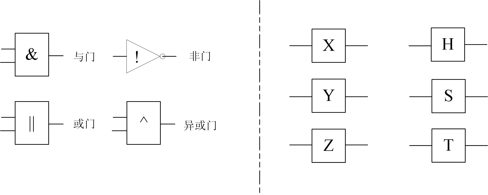
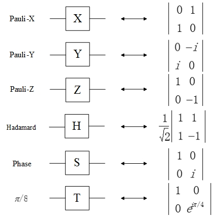
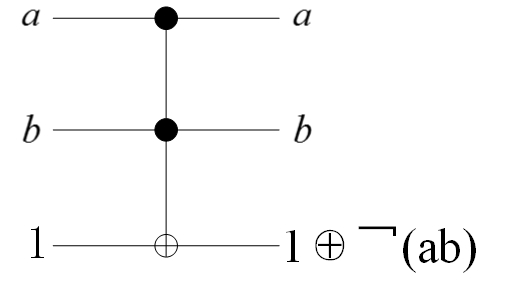
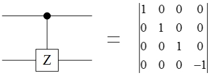
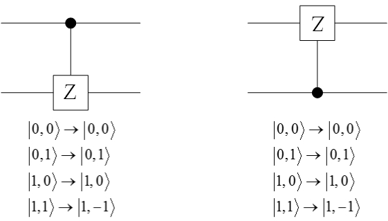
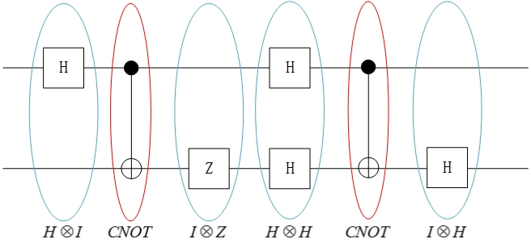
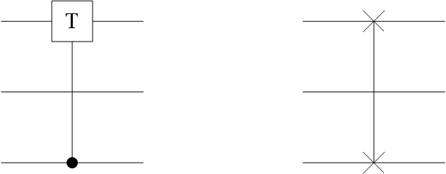
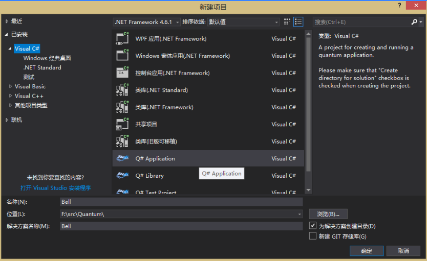

<script type="text/javascript" async src="http://cdn.mathjax.org/mathjax/latest/MathJax.js?config=TeX-AMS-MML_HTMLorMML">
</script>
# 写给开发者的量子计算入门教程 

##															 						---  基于Q#语言描述


**$$version: 0.1.0$$**

**$$date:2018-05-01$$**


## 前言

写作这份文档时，我只是一个对计算机、对量子计算充满好奇心、有着极大兴趣的人。从始至终，我深知那些深奥的物理定理和数学分析对初学者而言意味着怎样的难度和挑战，因此，我写这份文档的目的就是希望它能稍稍降低量子计算的门槛，如果我的创作真的帮助到了你，那么我将十分荣幸。

在这份文档中，我不会涉及过多和过深的物理学、量子力学以及数学等相关内容，但希望读者能够有一定的线性代数和概率论的基础，这个基础不需要多深，只要了解过基本的矩阵、向量、空间等知识即可。为了达到降低门槛通俗易懂的目的，我极力地削减了文档中与数学及其他学科有关的内容，但是还是有一些内容不得不引入一些数学计算、证明等，但是我不希望你纠结于这些内容，作为开发者，底层的东西对我们而言应该是透明的，我们只需要知道它是什么，给它一个输入它会产生什么样的输出即可，所以我们应该重点关注那些结论性的东西，数学证明之类的只是为了辅助理解，不应该成为我们的重点。

从上世纪二十年代到现在，量子力学已经诞生了百年时间，相信很多人都听说过“测不准原理”和“薛定谔的猫”，量子力学就是以这样违背我们正常认知的特性让人类爱恨交加。量子计算最早是由[Paul Benioff在](https://en.wikipedia.org/wiki/Paul_Benioff)在上世纪80年代提出的，之后经过了[Richard Feynman](https://en.wikipedia.org/wiki/Richard_Feynman)等人的发展和补充，量子计算开始真正进入人们的视野，目前为止，对量子计算的研究已经有了一定的成果，加拿大[D-Wave](https://en.wikipedia.org/wiki/D-Wave_Systems)系统已经研制成功16位量子比特的超导量子计算机，Google、微软等国际巨头也已经开始在量子计算方面发力，国内的阿里巴巴、中科院等也取得了一定的成绩，除了硬件上的成果，量子计算所需要的开发工具也已经逐渐成熟，Qbsolv、QCL、 LIQU等许多量子编程语言已经得到了实际的应用。

这份文档所专注的部分就是量子程序开发，并且使用微软公司推出的量子开发工具：Q#语言。Q#语言是由微软在2017年推出的新的量子计算开发工具，相比早先的量子开发语言，它引入了更多比较现代的编程元素，对开发者也更友好。

这份文档的内容主要分两大部分：

- 量子计算基础知识
- Q#量子开发工具介绍和使用

还有第三部分**量子算法**会逐步进行编写和完善，但目前不会出现在文档中。文档内容主要参考了一些书籍、论文、维基百科以及[微软公司官方文档](https://docs.microsoft.com/en-us/quantum/?view=qsharp-preview)等，具体请见参考目录。

量子计算是一个广阔的领域，也是一门非常复杂的学科，它与物理、数学、计算机、信息学等学科有着较大的交联，因此学习它绝不是一件容易的事情，我也希望能与更多的人一起学习，一起进步。如果你在阅读文档的过程中发现有任何错误、不妥或疑惑，希望你能联系我，我的邮箱是：1036014410@qq.com 。

## 目录

[TOC]

## 第一部分 量子计算的基础知识

在经典计算中，信息存储和处理的基本单位是bit，每一个bit要么表示确定的0，要么表示确定的1。与之相似，量子计算中信息存储和处理的基本单位是qubit（量子比特，Quantum Bit），它也有两个状态$$|0 \rangle$$ 和$$|1 \rangle$$ ，与经典bit不同的是，qubit并不处于一个特定的状态下，而是处于两个基本状态$$|0\rangle$$ 和$$|1\rangle$$ 的量子叠加态中，或者说它同时处于$$|0\rangle$$ 和$$|1\rangle$$ 状态。

正是这种诡异的特性，使得量子计算在展现着强大能力的同时，也因其太过违反人们的认知而常常让我们陷入困惑。量子计算与传统的计算机程序设计、开发之间的存在着显著的差别，在经典计算领域里，一切都是确定的，你可以精确地操纵每一个bit来为你服务，可是，一旦进入量子领域，主宰这个世界的就不再是你，每一个qubit都是一副既不可远观（观察造成量子态坍缩）也不可亵玩（量子纠缠）的高冷范儿。理解量子的行为模式、演进过程是学习量子编程的第一步，这一部分的内容主要是对量子、量子态、量子系统等量子计算基础内容的介绍，学习该内容需要对线性代数和概率论的相关概念有基本的了解，不过放心，对于其中的数学我会尽可能地使用简单、便于理解的语言进行描述，不会对学习带来困扰。通过本章的学习，希望能帮助你建立对量子系统的初步印象和认知。

## 第一章 单量子系统

### qubit

qubit是量子计算中信息存储和处理的基本单位。对于开发者而言，我们不是物理学家，也不是数学家，我们不需要深究量子的内部结构和演变原理，一个qubit对我们而言就是一个抽象的数学模型，它的状态称为**量子态**，由一个含有两个元素的向量来描述，这个向量叫做**量子态向量**（也叫做**态矢**）。如下所示的向量都表示了某一个特定的量子态。

​							$$\begin{bmatrix} 1 \\  0 \end{bmatrix}$$ ，$$\begin{bmatrix} 0 \\  1 \end{bmatrix}$$ ，$$\begin{bmatrix} \frac{1}{\sqrt{2}} \\  \frac{1}{\sqrt{2}} \end{bmatrix}$$ ，$$\begin{bmatrix} \frac{1}{\sqrt{2}} \\  \frac{-1}{\sqrt{2}} \end{bmatrix}$$  ,$$\begin{bmatrix} \frac{1}{\sqrt{2}} \\ \frac{i}{\sqrt{2}} \end{bmatrix}$$ 

​										图1.1  态矢量

当然，并不是任意的二维向量都能用来描述一个qubit的状态，描述量子态的向量的模长必须为1，所谓向量的模长定义如下：

​								$$M(v) = \sqrt{|a_{1}|^{2} + |a_{2}|^{2} + ... + |a_{n}|^{2}}$$

> 某些资料上使用术语范数，实际上范数有多种形式，为了避免混淆，此处使用了模长的概念。


其中，$$v$$ 是一个$$n$$ 维的矢量，$$a_{i}$$ 是$$v$$ 的元素。

图1中的几个向量中，$$\begin{bmatrix} 1 \\  0 \end{bmatrix}$$ 和$$\begin{bmatrix} 0 \\  1 \end{bmatrix}$$ 有着特殊的意义，它们代表着一个量子的基态，任意一个量子态都可以由它们的线性叠加来表示。实际上，一个量子的所有状态构成了一个**量子态空间**，$$\begin{bmatrix} 1 \\  0 \end{bmatrix}$$ 和$$\begin{bmatrix} 0 \\  1 \end{bmatrix}$$ 是这个空间的一组基底，它们也对应着经典计算中一个bit值的0和1，在量子计算中，我们更常使用符号$$|0\rangle$$ 和$$|1\rangle$$ 来表示这一组基态矢量，这种符号叫做Dirac符号，我们会在后文中详细介绍。当然了，学过线性代数的同学肯定知道一个空间的基底不止一组，对于量子态空间而言同样如此。

### 1.2 单量子态的测量

在经典世界中，我们能够清楚地知晓一个对象的状态，例如一张桌子的大小，一栋楼的高矮，一个电平的高低等，但在量子系统中，一切都显得扑朔迷离。正如海森堡不确定性原理所言，“我们不可能同时知道一个粒子的位置和它的速度”。也就是说我们无法得到一个量子的确切状态。

​			 

​										图1.2  薛定谔的猫

相信很多人都听说过“薛定谔的猫”，当我们未对其进行观察时，猫处于既死又活的叠加态，一旦我们进行了观察，猫就立即处于要么死要么活的确定态。量子也是这样，根据量子力学原理，当对量子进行测量或观察（位置、动量等）时，必然会导致量子态**坍缩**。我们只能得到测量后的一种确定的状态，而无从知晓测量前量子的真正状态。

测量会导致量子态坍缩为某个基态（$$|0 \rangle​$$ 或$$|1 \rangle​$$ )。一个状态为$$|\psi \rangle​$$ 的量子，其状态可以表示为$$|\psi \rangle = \alpha |0 \rangle + \beta |1 \rangle​$$ ，其中$$\alpha​$$ 和$$\beta​$$ 均为复数，对其进行测量后得到状态$$|0 \rangle​$$ 的概率为$$| \alpha |^2​$$ ，得到状态$$|1 \rangle​$$ 的概率为$$ | \beta |^2​$$ ，根据概率论的知识，我们可以得出$$\alpha​$$ 和$$\beta​$$ 满足$$| \alpha |^2 + | \beta |^2 = 1​$$ 。

上面的描述似乎说明了我们永远也无法得到一个量子的确切状态，无法得到确切状态的系统怎么会有用呢？并且又怎么为我们所用呢？

不要着急，我们慢慢揭开她神秘的面纱。

### 1.3 量子门

在经典计算中，对bit的处理和操作是通过一系列各种各样的门（Gate）来实现的。常见的有与门、非门、或门和异或门等，我们日常所写的程序最终都由这些门来具体执行。量子计算也遵循这一套路，通过各种**量子门**对量子进行相应的操作，常用的量子门有$$X$$、$$Y$$、$$Z$$、$$S$$、$$H$$和$$T$$门等。各种常见的门对应的符号如下图所示，其中左侧为bit门，右侧为量子门。

 

​											图1.3  经典门与量子门

在上面的量子门中，X门对一个量子态取反，从这一点上来说，X门与经典的非门非常相似，不同之处在于X门作用于一个状态为$$\alpha |0 \rangle + \beta |1 \rangle$$量子时，得到的结果为$$\beta |0 \rangle + \alpha |1 \rangle$$ ，也就是交换了两个基态的系数，并不是改变它们的符号。

实际上，量子门与经典计算中的门操作之间并没有清晰明确的对应关系，并且对于每个量子门，其输入的qubit数量与输出的qubit数量必须保持一致（上图中量子门左右两侧的一条横线就代表着一个qubit），这一点与经典计算大不相同，我们都知道，与门、或门等都是接受两个bit输入而产生一个bit输出，这一基本差别也说明了虽然我们可以借鉴经典计算中的某些概念来加强对量子计算的理解，但始终要记住这两个领域存在本质的不同，千万不能生搬硬套。

我们使用向量来表示一个qubit的状态，那么自然而然地，每一个量子门操作也对应着一个矩阵。常见的量子门与对应的矩阵如下图所示。

​					 

​									图1.4  量子门与对应矩阵

实际上，我们熟知的大小为$$2 \times 2$$ 的单位矩阵$$I$$ 也对应一个量子门操作，当然这个门对量子态不产生任何影响。$$I$$ 、$$X（Pauli-X）$$ 、$$Y（Pauli-Y）$$ 和$$Z（Pauli-Z）$$ 门构成了Pauli量子门集，但我们通常会忽略$$I$$ 门。在上图中的几种量子门中，$$Z$$ 门作用于$$|0 \rangle$$ 时仍然得到$$|0 \rangle$$ ，作用于$$|1 \rangle$$ 时得到$$- | 1 \rangle$$ ，$$H$$ 门（Hadamard门）作用于$$|0 \rangle$$ 时得到$$(|0 \rangle + |1 \rangle) / \sqrt{2}$$ ，作用于$$|1 \rangle$$ 时得到$$(|0 \rangle - |1 \rangle) / \sqrt{2}$$ ，细心的你一定注意到了，$$T$$ 门（$$\pi / 8$$ 门）实际上是$$S$$ 门（Phase门）的平方根，因为$$e ^{i \pi / 4}$$ 是$$i$$ 的平方根（之所以称其为$$\pi/8$$ 而非$$\pi/4$$ 主要是历史原因）。这几种量子门在量子计算中非常重要，并且在后面的内容以及实际运用中也会频繁出现。

除了上面提到的量子门，那么还有其它的量子门吗？我负责任地告诉你，不仅有，而且有无穷多个。之所以有无穷多个量子门，是因为量子态空间是连续的，不像经典计算中，bit空间是离散的只有0、1两个值，因此量子态之间的转换关系、映射关系也是无穷无尽的。

每一个量子门操作对对应着一个矩阵，科学家已经证明，这个矩阵所需要满足的唯一条件就是它必须是**幺正矩阵**，同时这句话反过来也是成立的：**只要一个矩阵是幺正矩阵，那么它就能表示一个量子门操作**。那么什么是幺正矩阵呢？


> 定义一、一个$$n$$ 维复方阵的共轭转置矩阵与其逆矩阵相等，那么这个矩阵就是幺正矩阵。


以上面的$$S$$ 门$$\begin{bmatrix} \quad 1\qquad 0 \quad \\ 0\qquad i \end{bmatrix}$$为例，我们使用$$S^{\dagger }$$ 表示$$S$$ 的共轭转置矩阵，那么$$S ^{\dagger} = \begin{bmatrix} \quad 1\qquad 0 \quad \\ 0\quad -i \end{bmatrix}$$，计算可得$$SS ^{\dagger} = I$$ ，也就是说$$S ^{\dagger} = \bar{S}$$ ，这里的$$\bar{S}$$ 表示$$S$$ 的逆矩阵，因此矩阵$$S$$ 就是一个幺正矩阵，或者也可以说矩阵$$S$$ 是幺正的。通过简单的验算，我们可以证明上面提到的X、Y、Z门等都是幺正的。

那么为什么量子门矩阵必须是幺正的呢？这是因为，根据量子力学的原理，量子态的演变必须是幺正的。式1是[Schrodinger 方程](https://en.wikipedia.org/wiki/Schr%C3%B6dinger_equation)，它描述了一个量子态在时域上的演进，式中的$$h$$ 是[普朗克常量](https://en.wikipedia.org/wiki/Planck_constant)，H是一个特定的[汉密尔顿算子（Hamiltonian）](https://www.encyclopediaofmath.org/index.php/Hamilton_operator)，这里我们不必对其进行深究。对式1进行积分运算后我们最终可以得到$$t1$$ 和$$t2$$ 时刻的量子态之间的演进过程，如式3所示。可以证明式3中的$$exp[\frac {-iH(t_{2} - t_{1})} {h}] $$ 是幺正的，它对应的幺正矩阵用$$U(t_1,t_2)$$ 表示【详细证明过程请《Quantum_Computation_and_Quantum_Information》第82到83页】，因此量子门必须是幺正的。从另一个更直观的角度来看，量子空间是一个连续空间，一个量子态可以演进为任意其它量子态，同时演进后的量子态依然能回归最初的状态，这意味着量子门操作必须是可逆的，在这个过程中不能有信息的丢失，幺正矩阵恰恰就代表着这样的可逆过程。例如有一个状态为$$|\psi \rangle = \frac{1}{\sqrt{2}}\begin{bmatrix} 1 \\ 1\end{bmatrix}$$ 的量子，先对其应用$$S$$ 门，再应用$$S ^{\dagger}$$ 门，因为对量子应用量子门操作相当于态矢量左乘相应的矩阵，因此上述过程可表述为$$S ^{\dagger} ( S\cdot |\psi \rangle) = (S ^{\dagger} \cdot S) \cdot |\psi \rangle = I \cdot |\psi \rangle = |\psi \rangle$$ ，经过了两次门操作后，量子又回到了最初的状态。

​									$$ih \frac{d|\psi \rangle}{dt} = H|\psi \rangle$$ (1)

​									$$\int_{|\psi_{t_1} \rangle}^{|\psi_{t_2} \rangle} \frac{ihd|\psi \rangle}{H|\psi \rangle} = \int_{t_{1}}^{t_{2}}dt$$ (2)

​									$$|\psi_{t_1}\rangle = exp[\frac {-iH(t_{2} - t_{1})} {h}] |\psi (t_{2}) \rangle= U(t_{1},t_{2}) | \psi (t_{1}) \rangle$$ (3)

幺正矩阵有着许多非常有用而又有趣的性质。例如它作用于一个向量时不会改变该向量的模长，构成它的列向量或行向量同时也是一组标准正交基等，这些性质我们不再赘述，以后用到时我们会详细说明，感兴趣的同学也可以查阅相关资料。

### 1.4 Dirac符号

前面的章节中，描述一个量子的状态我们使用了向量和Dirac符号相结合的方式，现在我们对Dirac符号进行详细的讲解。

[Dirac符号](https://en.wikipedia.org/wiki/Bra%E2%80%93ket_notation)是以其提出者狄拉克的名字命名的，它在1939年由狄拉克提出之后，随即便与[希尔伯特空间](https://en.wikipedia.org/wiki/Hilbert_space)一起构成了量子力学的基本分析工具。Dirac将希尔伯特空间一分为二，成为两个相互对偶的空间，用右矢表示量子态矢量，形式为$$|\cdot \rangle$$ ，用左矢表示量子态对偶矢量，形式为$$\langle \cdot |$$ ，右矢是一个列向量，左矢是右矢的共轭，它是一个行向量。这一符号体系非常简洁明了，右矢即态矢，其符号箭头指向右侧，左矢就是其共轭矢量，符号箭头指向左侧，我们使用$$|0 \rangle$$ 和$$|1 \rangle$$ 分别表示量子态的两个基态$$\begin{bmatrix} 1 \\ 0\end{bmatrix}$$ 和$$\begin{bmatrix} 0 \\ 1\end{bmatrix}$$ ，注意$$|0 \rangle$$ 并不是0向量（$$\begin{bmatrix} 0 \\ 0\end{bmatrix}$$ )。Dirac符号也叫做“$$bra-ket$$"符号，其提出者狄拉克将”括号（bracket）“这个单词一分为二，左边为”$$bra$$"，右边为“$$ket$$"，因此左矢$$\langle \cdot |$$又叫做”$$bra$$"，右矢$$|\cdot \rangle$$又叫做“$$ket$$"。

我们将量子计算中一些常用的运算总结在了表1.1中，其中包含了使用Dirac符号进行内积、外积等运算的形式。


*表1.1  常用运算*

|                     运算                      |                             功能                             |
| :-------------------------------------------: | :----------------------------------------------------------: |
|                    $$Z ^*$$                     |           复数$$Z$$ 的共轭，如$$(1 + i) ^* = (1 - i)$$           |
|                $$|\psi \rangle$$                |                      右矢，也叫做$$ket$$                       |
|                $$\langle \psi|$$                |             左矢（右矢的对偶矢量），也叫做$$bra$$              |
|       $$\langle \varphi | \psi \rangle$$        |     两个矢量$$| \varphi \rangle$$ 和$$|\psi \rangle$$ 的内积     |
|      $$| \varphi \rangle \langle \psi |$$       |     两个矢量$$| \varphi \rangle$$ 和$$|\psi \rangle$$ 的外积     |
| $$| \varphi \rangle \bigotimes | \psi \rangle$$ |    两个矢量$$| \varphi \rangle$$ 和$$|\psi \rangle$$ 的张量积    |
|      $$| \varphi \rangle | \psi \rangle$$       |                     矢量张量积的简写形式                     |
|                    $$A ^*$$                     |                        矩阵$$A$$ 的共轭                        |
|                   $$A ^{T}$$                    |                        矩阵$$A$$ 的转置                        |
|                $$A ^{\dagger}$$                 | 矩阵$$A$$ 的转置共轭，$$\begin{bmatrix} \quad a\qquad b \quad \\ c\qquad d \end{bmatrix} ^{\dagger} = \begin{bmatrix} \quad a^*\qquad c^* \quad \\ b^*\qquad d* \end{bmatrix}$$ |
|               $$A \bigotimes B$$                |                  两个矩阵$$A$$ 和$$B$$ 的张量积                  |
|     $$\langle \varphi | A | \psi \rangle$$      | $$| \varphi \rangle$$ 与$$A | \psi \rangle$$ 的内积，等价于$$A ^{\dagger} | \varphi \rangle$$ 与$$| \psi \rangle$$ 的内积 |

我们重点讲解一下内积、外积与张量积运算，这几种运算广泛应用于量子计算、量子程序设计、量子门分解等各种场合中，知悉这些运算的内涵和方法是学习量子计算的基础，但是请放心，我会以非常简单的形式告诉你这些运算的内涵，绝对不会让你为繁杂的数学运算所困扰。

首先来看矢量的内积运算。矢量的内积也叫做点积，假设我们有两个矢量$$| \alpha \rangle$$ 和$$| \beta \rangle$$ ，这两个矢量拥有相同的元素个数$$N$$ ，那么它们的内积定义为：

​							$$|\alpha \rangle \cdot | \beta \rangle = \alpha_{1}^*\beta_{1} + \alpha_{2}^*\beta_{2} + \cdots + \alpha_{N}^*\beta_{N} = \sum_{i=1}^{N}\alpha_{i}^* \beta_{i} $$

其中$$\alpha_{i}$$ 和$$\beta_{i}$$ 分别是这两个矢量的元素。从上面的等式中可以看出，两个矢量的内积就是第一个矢量中各元素的共轭与第二个矢量对应元素乘积的加和，使用Dirac符号可以非常方便地将内积表示为：$$\langle \alpha | \beta \rangle$$ ，其左侧部分$$\langle \alpha |$$ 正是矢量$$| \alpha \rangle$$ 的复数共轭，且与$$|\alpha \rangle$$ 相互对偶。

两个矢量$$| \alpha \rangle$$ 和$$| \beta \rangle$$ 的外积定义为$$ |\alpha \rangle \langle \beta|$$ ，因为$$|\alpha \rangle$$ 和$$\langle \beta|$$ 分别为列向量和行向量，因此矢量的外积是一个方阵，这个方阵的大小为$$N \times N$$ 。

两个矩阵$$A$$ 和$$B$$ 的张量积表示为$$A \bigotimes B$$ ，它的定义如下所示：

​						$$A \bigotimes B = \begin{bmatrix}  A_{11}B \quad A_{12}B \quad \cdots \quad A_{1n}B \\  A_{21}B \quad A_{22}B \quad \cdots \quad A_{2n}B \\  \vdots \quad \qquad \vdots \quad \qquad \vdots \quad \qquad \vdots \\ A_{m1}B \quad A_{m2}B \quad \cdots \quad A_{mn}B\end{bmatrix}$$ 

其中，矩阵$$A$$ 的大小为$$m \times n$$ 。矢量可以看做是只有一列元素的矩阵，因此矢量之间的张量积也遵循着上面的运算形式，两个矢量$$| \alpha \rangle$$ 和$$| \beta \rangle$$ 的张量积为：

​									$$| \alpha \rangle \bigotimes | \beta \rangle = \begin{bmatrix} \alpha_{1} |\beta \rangle \\ \alpha_{2} |\beta \rangle \\ \vdots \\ \alpha_{N}|\beta \rangle \end{bmatrix}$$ 

### 1.5 量子态可视化

目前为止，我们对量子态以及量子门这些基本对象的描述都是通过数学工具进行的，这一节里我们使用另一种更直观的方式对它们进行可视化的描述。

首先，一个量子态可以表示为$$|\psi \rangle = \alpha |0 \rangle + \beta |1 \rangle$$ ，这个形式使我们自然而然地想到使用一个二维空间来描述一个量子态，$$|0 \rangle$$ 和$$|1 \rangle$$ 分别是这个二维空间的坐标轴，态矢量$$|\psi \rangle$$ 为一条由原点出发指向坐标$$(\alpha , \beta)$$ 的有向线段，图1.5所示为态矢量$$|\psi \rangle$$ 和$$X$$ 门作用于$$|\psi \rangle$$ 的示意图。


​							图1.5  量子态在二维平面内的示意图

但是由于量子态空间是一个复数空间，使用上面的二维平面并不能完备地对这个空间进行描述。我们现在重新审视量子态$$|\psi \rangle = \alpha |0 \rangle + \beta |1 \rangle$$ ，因为$$\alpha$$ 和$$\beta$$ 是复数，根据[欧拉公式](http://www.baike.com/wiki/%E6%AC%A7%E6%8B%89%E5%85%AC%E5%BC%8F)和三维空间坐标变换等数学工具，$$|\psi \rangle$$ 可以表示为：

​					$$|\psi \rangle = e^{ir}(cos \frac{\theta }{2}|0 \rangle + e^{i\phi }sin \frac {\theta}{2} | 1 \rangle)$$  *[公式的推导可以参考https://en.wikipedia.org/wiki/3-sphere]*

其中$$r$$ 、$$\theta$$ 和$$\phi$$ 均为实数，$$r$$ 在这里是一个全局的相位变换，通常我们不用理会它，所以得到$$|\psi \rangle = cos \frac{\theta }{2}|0 \rangle + e^{i\phi }sin \frac {\theta}{2} | 1 \rangle$$ ，这个式子可以用一个单位球面进行展现，如图1.6所示。


​										图1.6  Bloch Sphere

这个三维单位球面就是Bloch Sphere，它的上、下两个极点分别表示$$|0 \rangle$$ 和$$|1 \rangle$$ 。Bloch Sphere不仅能用来表示量子态，同时能用来演示量子门作用于量子时量子态的演进。假设我们有一个状态为$$\frac{1}{\sqrt{2}}(|0 \rangle + |1 \rangle)$$ 的量子，对其应用$$H$$ 门，演进过程可以用下面的Bloch Sphere展示出来，首先该态矢量绕$$y$$ 轴向下旋转$$90^{\circ}$$ ，最后绕$$x$$ 轴旋转$$180 ^\circ$$ 得到结果$$|0 \rangle$$ 。


​							图1.7  $$H$$门应用于$$\frac{1}{\sqrt{2}}(|0 \rangle + |1 \rangle)$$ 的演进过程

$$H$$ 门是最重要的量子门之一，它作用于$$|0 \rangle$$ 时得到$$|\frac{1}{\sqrt{2}}(|0 \rangle + |1 \rangle)$$ ，作用于$$|1 \rangle$$ 时得到$$\frac{1}{\sqrt{2}}(|0 \rangle - |1 \rangle)$$ ，这两个结果都是$$|0 \rangle$$ 和$$| 1 \rangle$$ 的叠加态，因此$$H$$ 的一个重要作用就是创造量子叠加。根据量子测量一节的知识，对这两个量子态测量得到$$|0 \rangle$$ 和$$|1 \rangle$$ 的概率都是$$\frac{1}{2}$$ ，也就是说测量结果是完全随机的，我们在开发过程中经常会用一些随机数生成算法，但这些算法实质上都是“伪随机”的，而上面的量子测量是“真随机”的，物理原理为这种随机性提供了强力保证，这也正是$$H$$ 门的重要性所在，在很多量子算法中，都会有使用$$H$$ 门的场景。

在量子态空间中，有无穷多的量子门，就有无穷多对应的幺正矩阵，那么随之而来的一个问题就是，每次应用新的量子门时我们都要重新定义一个幺正矩阵吗？每个量子门操作实际上最终都要由相应的硬件来完成，那面对这无穷多的量子门，我相信世界上最伟大的工程师也会望而却步。幸运的是，人们已经证明，存在一个量子门集合，这个集合中只有几种常见的量子门，它们经过不同的组合可以构建出任意的量子门，这个集合也叫做**通用量子门集合**（后文会有更详细的论述）。并且，任意的幺正矩阵都能分解成如下形式（下面的这些数学运算不需要理解或记忆，只要知道一个幺正矩阵可以被分解即可）：

​									$$U = e^{i\alpha}R_z(\beta)R_y(\gamma )R_x(\delta )$$ 

其中，

​							$$R_z(\beta) = e^{-i\beta Z/2} = cos \frac{\beta}{2}I - isin{\frac {\beta}{2}}Z = \begin{vmatrix}e^{-i\beta/2} & 0 \\ 0 & e^{i\beta/2} {2}\end{vmatrix}$$ 

​							$$R_y(\gamma) = e^{-i\gamma Y/2} = cos \frac{\gamma}{2}I - isin{\frac {\gamma}{2}}Y = \begin{vmatrix}cos \frac{\gamma}{2} & -sin \frac{\gamma}{2}\\ sin \frac{\gamma}{2} & cos \frac{\gamma}{2}\end{vmatrix}$$ 

​							$$R_x(\delta) = e^{-i\delta X/2} = cos \frac{\delta}{2}I - isin{\frac {\delta}{2}}X = \begin{vmatrix}cos \frac{\delta}{2} & -i sin \frac{\delta}{2} \\ -isin \frac{\delta}{2} & cos \frac{\delta}{2}\end{vmatrix}$$ 

它们分别是由$$X$$ 、$$Y$$ 和$$Z$$ 门等经过旋转等变换得到的，所以任意的量子门都可以通过其它的门构建出来。Bloch Sphere虽然可以很好的展现量子和量子门操作，但它也有自己的局限，比如在面对接下来要讲的多量子系统时就无能为力了。

## 第二章 多量子系统

一个量子系统的状态用一个向量来表示，假设有一个由两个qubit组成的双量子系统，系统中每一个qubit都有两个基本状态$$|0 \rangle$$ 和$$|1 \rangle$$ ，那么显而易见这个双量子系统的基本状态就有4种：$$|0 \rangle |0 \rangle,|0 \rangle |1 \rangle,|1 \rangle |0 \rangle,|1 \rangle |1 \rangle$$ ，简写为：$$|00 \rangle,|01 \rangle,|10 \rangle,|11 \rangle$$ 。事实上，这几种双量子系统的基本状态就是每一个量子基本状态的张量积，根据前面所讲的张量积的计算方法，这几种基态实际上就是：

​							$$|00 \rangle = |0 \rangle \bigotimes |0 \rangle = \begin{vmatrix} 1 \\ 0 \\ 0 \\ 0 \end{vmatrix}$$ ，$$|01 \rangle = |0 \rangle \bigotimes |1 \rangle = \begin{vmatrix}0 \\ 1 \\ 0 \\ 0 \end{vmatrix}$$ 

​							$$|10 \rangle = |1 \rangle \bigotimes |0 \rangle = \begin{vmatrix} 0 \\ 0 \\ 1 \\ 0 \end{vmatrix}$$ ，$$|11 \rangle = |1 \rangle \bigotimes |1 \rangle = \begin{vmatrix} 0 \\ 0 \\ 0 \\ 1 \end{vmatrix}$$ 

这四个向量构成了双量子状态空间的基底，这个空间中其它向量都能由它们的线性叠加表示出来。所以一个双量子系统的状态$$|\psi \rangle$$ 可以表示为$$|\psi \rangle = \alpha_{00}|00 \rangle + \alpha_{01} |01 \rangle + \alpha_{10}|10 \rangle + \alpha_{11}|11 \rangle$$ ，并且$$| \alpha_{00} |^2 + | \alpha_{01} |^2 + | \alpha_{10} |^2 + | \alpha_{11} |^2 = 1$$ ，$$\alpha_{x}^2$$ 为测量这个系统得到相应输出结果的概率。 当qubit数量为$$n(n > 1)$$ 时，多量子系统的基态就是系统内每个量子基态的张量积，$$n$$ 量子系统拥有$$2^{n}$$个基态，它们构成了多量子系统量子态空间的基底，下面所示的就是3量子系统的基态。

​							$$|000 \rangle = \begin{vmatrix} 1 \\ 0 \\ 0 \\ 0 \\ 0 \\ 0 \\ 0 \\ 0 \end{vmatrix}$$ ，$$|001 \rangle = \begin{vmatrix} 0 \\ 1 \\ 0 \\ 0 \\ 0 \\ 0 \\ 0 \\ 0 \end{vmatrix}$$ ，$$|010 \rangle = \begin{vmatrix} 0 \\ 0 \\ 1 \\ 0 \\ 0 \\ 0 \\ 0 \\ 0 \end{vmatrix}$$ ，$$|011 \rangle = \begin{vmatrix} 0 \\ 0 \\ 0 \\ 1 \\ 0 \\ 0 \\ 0 \\ 0  \end{vmatrix}$$ 

​							$$|100 \rangle = \begin{vmatrix} 0 \\ 0 \\ 0 \\ 0 \\ 1 \\ 0 \\ 0 \\ 0 \end{vmatrix}$$ ，$$|101 \rangle = \begin{vmatrix} 0 \\ 0 \\ 0 \\ 0 \\ 0 \\ 1 \\ 0 \\ 0 \end{vmatrix}$$ ，$$|110 \rangle = \begin{vmatrix} 0 \\ 0 \\ 0 \\ 0 \\ 0 \\ 0 \\ 1 \\ 0 \end{vmatrix}$$ ，$$|111 \rangle = \begin{vmatrix} 0 \\ 0 \\ 0 \\ 0 \\ 0 \\ 0 \\ 0 \\ 1 \end{vmatrix}$$ 

随着$$n$$ 的增长，多量子系统的基态数量呈指数级增加，$$n = 500$$ 时，这个量子系统所包含的基态数量甚至超过了宇宙中所有粒子的数量，这将是一个多么广阔的量子态空间！可以说，量子计算的强大能力正是来源于此，我们一步步去发现它背后广阔的天地。

### 2.1 量子测量

在前面的单量子系统中，我们也曾经提到过量子测量的概念。回想一下，测量会导致量子态向其基态坍缩，一个状态为$$|\psi \rangle = \alpha |0\rangle + \beta |1 \rangle$$ 的量子，经过测量后得到$$|0 \rangle$$ 或$$|1 \rangle$$ 的概率分别为$$| \alpha | ^{2}$$ 和$$| \beta | ^{2}$$ ，同样，测量一个状态为$$|\psi \rangle = \alpha_{00}|00 \rangle + \alpha_{01} |01 \rangle + \alpha_{10}|10 \rangle + \alpha_{11}|11 \rangle$$ 的双量子系统，得到结果$$\{|00 \rangle , |01 \rangle ,|10 \rangle,|11 \rangle\}$$ 的概率分别为$$\{   |\alpha_{00}|^{2},|\alpha_{01}|^{2},|\alpha_{10}|^{2},|\alpha_{11}|^{2}\}$$ 。

量子测量得到的是确定的经典世界的结果，这个结果可以看做是量子系统在经典世界上的投影。

量子系统的测量操作用符号$$M$$表示，一个由$$n$$ 个量子组成系统，其基态有$$2^{n}$$个，这也就意味着有$$2^{n}$$个不同的测量操作符，这些测量操作构成了一个测量集合$$\{M_{m}\}$$ ，索引$$m$$ 表示经过测量后所得到的结果。一个量子态为$$|\psi \rangle$$ 的系统，在经过$$M_{m}$$ 测量操作测量后，产生结果$$m$$ 的概率为：

​										$$p(m) = \langle \psi | M_{m}^{\dagger}M_{m} |\psi \rangle$$ 

在测量后，系统所处的状态为：

​										$$\frac {M_{m} | \psi \rangle} {\sqrt {\langle | M_{m}^\dagger M_{m} |\psi \rangle}}$$ 

并且，测量操作符必须遵循以下约束：

​										$$\sum_{m} M_{m}^\dagger M_{m} = I$$ 

同时，所有可能的测量记过的概率和必须是1，因此：

​							$$1 = \sum_{m}p(m) = \sum_{m}{\langle \psi | M_{m}^\dagger M_{m} |\psi \rangle}$$ 

从数学角度来看，量子操作符是量子态系统没个基底与自身的外积。我们以单量子系统为例，构建单量子系统的两个测量操作符为：$$M_{0}=|0 \rangle \langle 0|,M_{1}=|1 \rangle \langle 1|$$ ，观察这两个操作符，我们可以发现$$M_{0}^\dagger M_{0} = M_{0},M_{1}^\dagger M_{1} = M_{1}$$ ，所以$$M_{0}^\dagger M_{0} + M_{1}\dagger M_{1} = M_{0} + M_{1} = I$$ ，因此这两个操作符符合上面的要求，假设一个单量子系统的状态为$$|\psi \rangle = \alpha |0 \rangle + \beta |1 \rangle$$ ，分别应用这两个测量操作，我们得到：

​						$$p(0) = \langle \psi | M_{0}^\dagger M_{0} |\psi \rangle = \langle \psi | M_{0} |\psi \rangle = | \alpha |^{2}$$ 

​						$$p(1) = \langle \psi | M_{1}^\dagger M_{1} | \psi \rangle = \langle \psi | M_{1} | \psi \rangle = | \beta |^{2}$$ 

这就是我们在前面提到的测量一个单量子时得到$$|0 \rangle$$ 和$$|1 \rangle$$ 的概率分别为$$| \alpha |^{2}$$ 和$$| \beta |^{2}$$ 的由来，同时在测量后，这个量子所处的状态就变成：

​										$$\frac {M_{0} |\psi \rangle} {|\alpha |} = \frac{\alpha}{| \alpha |} |0 \rangle$$ 

​										$$\frac{M_{1} |\psi \rangle}{| \beta |} = \frac {\beta} {| \beta |} |1 \rangle$$ 

实际上结果就是$$|0 \rangle$$ 和$$|1 \rangle$$ 。

在多量子系统中，我们也可以仅测量其中一部分量子的状态。在这里我们要引入一个非常重要的双量子系统：Bell State（也叫做EPR pair）【引用由来】，这个系统的量子态为：

​										$$\frac {|00 \rangle + |11 \rangle} {\sqrt{2}}$$ 

该系统有一个非常有趣的特性：测量第一个量子时，得到$$| 0 \rangle$$ 的概率为$$\frac {1}{2}$$ ，此时系统测量后的状态为$$| 00 \rangle$$ ，得到$$|1 \rangle$$ 的概率同样为$$\frac{1}{2}$$，此时系统测量后的状态为$$|11 \rangle$$ ，也就是说，测得第一个量子的状态后，剩下的量子其状态与第一个是一致的，呈现出非常强的关联性。人们已经证明，Bell State中的这种强关联性甚至强于经典系统中这样的性质。这种性质的存在进一步说明了量子系统用于进行量子计算以及其他领域的可能性。【《Quantum_Computation_and_Quantum_Information》第17页】

### 2.2 多量子门

多量子门指的是作用于多量子系统上的受控的量子门，所谓受控指的是多量子门作用于系统时，系统中一部分量子状态的变换能影响其它的量子态。多量子门一般分为两个部分：控制部分和目标部分。控制部分的状态决定了目标部分的状态。

#### 2.2.1 controlled-NOT门

最基本的多量子门是 $$controlled-NOT$$ （受控非门）门，也叫$$CNOT$$ 门，以双量子系统为例，图2.1所示为双量子系统的$$CNOT$$ 门和其对应的量子门矩阵，图中，$$CNOT$$ 门上方的直线代表了控制量子，下方的直线代表着目标量子，当控制量子的装填为$$|1 \rangle$$ 时，$$X$$ 门作用于目标量子，为$$| 0 \rangle$$ 时，目标量子不受任何影响。


​									图2.1  $$CNOT$$门

双量子$$CNOT$$ 门输入也输出量子态的对应关系为：

​							$$| 00 \rangle \rightarrow |00 \rangle ; |01 \rangle \rightarrow |01 \rangle ; |10 \rangle \rightarrow |11 \rangle ; |11 \rangle \rightarrow |10 \rangle$$ 

从另一个角度看，$$CNOT$$ 门的作用相当于对控制量子和目标量子进行模二加运算（异或运算），也就是说，对于状态为$$|A,B \rangle$$ 的双量子系统，经$$CNOT$$ 门作用后，其状态为$$|A , A \oplus B \rangle$$ ，并且模二加运算的结果放在了目标量子中，上图中间部分的图像就是对这一过程的描述。

#### 2.2.2 Toffoli门

严格地说，$$Toffoli$$门并不属于量子计算的范畴。在前面我们曾经说过，经典计算中的部分门操作不是幺正的，或者说不是可逆的，而量子门是可逆的并且可以用其他的量子门进行表示，那么在经典世界中是否存在一个门，这个门可以用来表示其它的门并且它还是可逆的？

答案就是$$Toffoli$$门。$$Toffoli$$门有三个输入和三个输出，其中两个输入bit是$$controlled-bit$$ （控制bit），剩下的一个是$$target-bit$$ （目标bit），当两个控制bit都为$$1$$ 时，目标bit会被取反，相反则目标bit保持本身状态不变。下面的图就是$$Toffoli$$门的基本形式和其输入输出对照表。


​									图2.2  $$Toffoli$$门

$$Toffoli$$可以用来实现任意经典计算中的逻辑门，比如下面这个用$$Toffoli$$门实现的与非门（NAND Gate）。



​							图2.3  $$Toffoli$$门实现与非门

$$Toffoli$$门非常重要，之所以非常重要在于虽然它本身是经典计算中的产物，但同样能够用于量子计算中。如前文所述，量子门中输入与输出的qubit数量必须是一致的，$$Toffoli$$门完美地契合这一点，同时，下面的矩阵是$$Toffoli$$门的矩阵表示形式，可以证明这个矩阵是幺正的，从而$$Toffoli$$门也能应用于量子计算中。

​									$$\begin{bmatrix} 1\quad 0 \quad 0\quad  0\quad  0\quad  0\quad  0 \quad 0 \\ 0 \quad 1 \quad 0 \quad 0 \quad 0 \quad 0 \quad 0 \quad 0 \\ 0 \quad 0 \quad 1 \quad 0 \quad 0 \quad 0 \quad 0 \quad 0 \\ 0 \quad 0 \quad 0 \quad 1 \quad 0 \quad 0 \quad 0 \quad 0 \\ 0 \quad 0 \quad 0 \quad 0 \quad 1 \quad 0 \quad 0 \quad 0 \\ 0 \quad 0 \quad 0 \quad 0 \quad 0 \quad 1 \quad 0 \quad 0 \\ 0 \quad 0 \quad 0 \quad 0 \quad 0 \quad 0 \quad 0 \quad 1 \\ 0 \quad 0 \quad 0 \quad 0 \quad 0 \quad 0 \quad 1 \quad 0 \end{bmatrix}$$ 

$$Toffoli$$门说明了很重要的一点：**量子计算和经典计算可以通过某种形式得到形式上的统一**，从现实世界的角度来看，这一点也是完全合理的，毕竟所有的物理系统都可以用量子力学进行描述，同时，人们也已经证明量子计算机也符合图灵机的标准，尽管对人们来说它难以立即。这种统一的观点能够为量子计算的发展带来很大裨益。

#### 2.2.3 通用量子门集合

假设有一个量子门集合，其中包含了几种量子门，如果其他的量子门都能有这个集合中的元素通过不同的组合而实现【包括满足一定误差的条件】，那么这个量子门集合就是**通用量子门集合**。

目前，这样的通用量子门集合有两个，一个包含量子门：$$CNOT$$ 、$$Hadamard$$ 、$$Phase$$ 和$$\pi / 8$$ ，另一个则包含：$$CNOT$$ 、$$Hadamard$$ 、$$Phase$$ 和$$Toffoli$$ 。


## 第三章 量子线路

单独的量子门、量子系统并不能够完成真正的计算，只有将它们通过一定的规则和形式组合起来才能进行有用的工作，这样的组合就是**量子线路**，量子计算机等价于量子线路。

目前来看，我认为理解量子线路是进行量子计算和量子编程开发的敲门砖。量子编程与传统编程的区别的一部分也表现在这里。我们平时所做的开发工作，所接触到的编程语言、编程模型，无外乎就是分支、循环、递归等等程序设计元素的组合，但在量子计算中一切都不相同，有时候很简单的工作，比如计算$$1 + 1 = 2$$ ，如果用量子计算机去实现也会大费周折，但是量子计算的魅力也正在于此，从不同的视角和观点重新审视这个世界，就会有不同的感受和收获。

量子线路中主要包括量子门、输入和输出qubit等，每种元素在量子线路中都有其特定的符号表示，我们将常用的符号总结在了下面的图中。


### 3.1 量子线路的特点

现在我们来看一个量子线路的示例：

​					

​									图3.1  量子线路图示例

这是一个有三个输入的量子线路，三个输入qubit分别为一个为止状态的$$|\varphi  \rangle$$ 和两个$$|0 \rangle$$，我们将$$\varphi \rangle$$ 表示为$$|\varphi \rangle = \alpha |0 \rangle + |1 \rangle$$ 在图中，我们将线路中某一位置的量子态用虚线进行了标示。首先，两个$$| 0 \rangle$$ 经过一个$$H$$ 门和一个$$CNOT$$ 门的作用后，状态变为$$ \frac {1} {\sqrt{2}}(| 00 \rangle + |11 \rangle)$$，此时与第一个量子$$| \varphi \rangle$$ 构成的三量子系统的状态为：

​				$$| \varphi_{0} \rangle = |\varphi \rangle \otimes [\frac {1} {\sqrt{2}}(| 00 \rangle + | 11 \rangle)] = \frac{1}{\sqrt{2}}[\alpha |0 \rangle (| 00 \rangle + | 11 \rangle) + \beta |1 \rangle  (| 00 \rangle + | 11 \rangle)]$$ 

之后，再又一个$$CNOT$$ 门和$$H$$ 门的作用下，我们得到这个三量子系统的状态为：

​							$$| \varphi_{1} \rangle = \frac{1}{\sqrt{2}}[\alpha (|00 \rangle + |11 \rangle) + \beta|1 \rangle (|10 \rangle + |01 \rangle)]$$ 

​							$$|\varphi_{2}\rangle = \frac{1}{2}[\alpha(|0 \rangle + |1 \rangle)(|00 \rangle + |11 \rangle) + \beta(|0 \rangle - |1 \rangle)(|10 \rangle + |01 \rangle)]$$ 

状态$$|\varphi_{2} \rangle$$ 又可以写做：

​							$$| \varphi_{2} \rangle = \frac{1}{2}[|00 \rangle (\alpha |0 \rangle + \beta |1 \rangle) + |01 \rangle (\alpha |1 \rangle + \beta |0 \rangle) + |10 \rangle (\alpha |0 \rangle - \beta |1 \rangle) + |11 \rangle (\alpha |1 \rangle - \beta |0 \rangle)]$$ 

然后，使用测量$$M_{1}$$ 和$$M_{2}$$ 分别对前两个量子进行测量，测量导致量子态坍缩输出的是经典的bit，这一点线路图上也有相应的显示。

那么从这个线路图上我们能够得到什么呢？

1. 量子线路图的输入和输出量子数量必须是一致的。这一点我们在将量子门时已经说过，既然量子线路是由量子门组成的，那么量子线路必然也要遵循量子门输入输出量子数一致这一原则。
2. 量子线路中不能存在环状结构，也就是说在其中不能有循环。
3. 在电路图中，我们可以将几根电线合并在一起或者从一根电线中分出多跟电线，但在量子线路中，这是不允许也是行不通的。【前面应当补充no-coloning原理】。

这就是量子线路的特点，从中可以看出，它与我们日常所见到的电子线路非常不同。

我们继续讨论上面的量子线路图。在经过了两个测量符测量后，我们对第三个量子进行进一步的转换操作。每一个测量操作会得到两个结果：$$0$$ 或者$$1$$ ，因此我们就会得到4中测量结果，我们将每种结果以及对应的转换后的结果写在下面的表中：

表xxx  测量结果【矩阵从右至左产生作用，因此$$X$$写在右边】

| $$M_{1}$$ | $$M_{2}$$ |   转换操作   |                  结果                  |
| :-----: | :-----: | :----------: | :------------------------------------: |
|    0    |    0    | $$Z^{0}X^{0}$$ | $$\alpha |0 \rangle + \beta |1 \rangle$$ |
|    0    |    1    | $$Z^{0}X^{1}$$ | $$\alpha |1 \rangle + \beta |0 \rangle$$ |
|    1    |    0    | $$Z^{1}X^{0}$$ | $$\alpha |0 \rangle - \beta |1 \rangle$$ |
|    1    |    1    | $$Z^{1}X^{0}$$ | $$\alpha |1 \rangle - \beta |0 \rangle$$ |

现在我们知道了这个线路的输出结果，也知道了这个线路的工作过程，但是！这个线路到底有什么作用呢？从这些结果中也看不出个所以然来。那么我告诉你，我们刚刚进行了一次**量子通信**，你相信吗？

我们现在来设想一下，假设有两个人A和B，我们首先使用$$H$$ 门和$$CNOT$$ 门作用于两个量子态$$|0 \rangle$$ ，这时我们会得到他们的叠加态，也就是图中的$$| \varphi_{0} \rangle$$ ，然后将处于叠加态的两个量子分别交由A和B，随后A和B两个分道扬镳，许多年后，A想起了当年青梅竹马的B，他想送给B一个量子表达自己的思念之情（不要问我为什么要送量子），但是B并不知道A送给他的量子到底是什么状态，并且如果B要测量这个量子，那这个量子立马就会发生坍缩，从而导致B永远也不能知道A到底传送给了他什么，这时候他们当年分离之时各自拥有的那个量子就起作用了，A测量自己拥有的量子和传送的量子，得到一个结果，这个结果由两个bit构成（我们上面的测量结果），分别是：$$00 、01、10、11$$ ，A同时将这个测量结果传送给B，根据这个结果和上面的表格，B就能够知道A到底传送给了他什么。这就是**量子隐形传态**，实际上A并不需要真的给B传送一个量子，他只需要完成测量并将测量结果传送给B就可以了。

量子隐形传态描述的是一种量子之间存在的一种超距作用，处于纠缠态的量子，无论它们相隔多远，只要之中一个量子的状态发生了变换，另一个会立即产生相应的变化。但是要特别指出的是，量子隐形传态并不能超光速，以上面的通信过程为例，A在传给B量子的同时还要传输经典bit信息，而这一过程是不能超光速的，如果没有这些进店bit信息，B也就无从知晓传输的量子态，也就无法完成通信过程。因此量子隐形传态并不能超光速。

同时，上面的结果似乎能够让我们克隆一个量子$$|\varphi \rangle$$ ，这么一来就违背了不可克隆原理，但实际上最初的量子$$| \varphi \rangle$$ 在测量后发生了量子态坍缩，我们得到的结果是对其他量子进行一定的量子门操作的结果，因此量子并没有被克隆。

### 3.2 量子线路的矩阵表示

量子门可以用矩阵进行表示，同样，由量子门构成的量子线路也能表示为一个矩阵。本节内容就是讲量子线路与矩阵之间的转换关系。

#### 3.2.1 受控量子门与矩阵

受控量子门的矩阵表示很简单，以双量子系统来说，受控量子门对应矩阵是一个$$4 \times 4$$ 大小的矩阵，矩阵的左上角是一个$$2 \times 2$$ 的单位矩阵，左下角就是相应的被控量子门矩阵了，其他部分都为0。例如我们学过的受控量子门$$CNOT$$ ，它的矩阵表示形式就是：

​									$$\begin{bmatrix} 1 \quad 0 \quad 0 \quad 0 \\ 0 \quad 1 \quad 0 \quad 0 \\ 0 \quad 0 \quad 0 \quad 1 \\ 0 \quad 0 \quad 1 \quad 0 \end{bmatrix}$$ 

根据这个规则，我们再来构建其他受控门的矩阵形式，例如受控$$Z$$ 门，它的符号表示和矩阵形式如下图所示：



​									图3.2  $$Controlled-Z$$ 门

在上面的$$Controlled-Z$$ 门中，控制qubit在位于上方，目标qubit在下方，如果我们将它们的位置交换一下，那么相应的矩阵会改变吗？答案是不会，我们在下面的图中分别画出了两种线路图和它们的输入输出之间的关系，结果表明，上下位置的颠倒并不会对量子线路的结果造成影响，因此它们的矩阵形式是一样的。



   								图3.3  翻转$$Controlled-Z$$门

#### 3.2.2 量子线路与矩阵

我们以下面的量子线路为例讨论量子线路与矩阵之间的转换方法。


​										图3.4  量子线路示例

对于这样一个量子线路，我们首先将其以门为单位进行纵向的切分，就像图3.5中所示那样，每个分区内部的量子门矩阵的张量积就是这个分区的矩阵表示。



​									图3.5  量子线路分区

得到每个分区的矩阵后，整个线路的矩阵表示就是所有分区矩阵按从左到右的顺序相乘所得的矩阵乘积，那么上面的量子线路最终的矩阵表示为：

$$(H \otimes I)(CNOT)(I \otimes Z)(H \otimes H)(CNOT)(I \otimes H)$$ 

虽然上面是双量子系统的线路图，但无论多少个量子，线路图矩阵的构造方法是一样的。

但是有时候我们也会遇到一些麻烦，比如下面这样的多量子门线路，它门对应的矩阵是什么呢？



​								图3.6  $$3-qubit$$量子线路

这样的线路麻烦之处在于，控制量子和目标量子之间跨过了另外的量子，直接用上面分区中的方法是不行的，为此我们要寻找其它方法。

一个量子线路对应一个矩阵，我们将这个矩阵设为$$A$$ ，矩阵作用输入的量子态向量得到相应的输出，这个过程可以描述为：

$$A|\varphi \rangle = | \varphi^{'} \rangle$$ 

以图xxx中右侧的量子门线路为例，我们来求取矩阵$$A$$ 。这个量子门的作用是交换第$$1$$ 和第$$3$$ 个量子态而第二个量子态不受影响，我们将这个三量子系统的输入输出写在表3.1中：

*表3.1  输入输出表*

|      输入      |       输出       |
| :------------: | :--------------: |
| $$|000 \rangle$$ |  $$|000 \rangle$$  |
| $$|001 \rangle$$ |  $$|100 \rangle$$  |
| $$|010\rangle$$  | $$ | 010 \rangle$$ |
| $$|011 \rangle$$ |  $$|110 \rangle$$  |
| $$|100 \rangle$$ |  $$|001 \rangle$$  |
| $$|101 \rangle$$ |  $$|101 \rangle$$  |
| $$|110 \rangle$$ |  $$|011 \rangle$$  |
| $$|111 \rangle$$ |  $$|111 \rangle$$  |

将上表的量子态用矩阵运算的形式可以表示为：

​					$$A \begin{bmatrix} 1 \quad 0 \quad 0 \quad  0  \quad 0 \quad  0 \quad  0 \quad  0 \\ 0 \quad  1  \quad 0  \quad 0 \quad  0  \quad 0  \quad 0  \quad 0 \\ 0  \quad 0 \quad  1 \quad  0  \quad 0  \quad 0 \quad  0  \quad 0 \\ 0 \quad  0 \quad  0  \quad 1  \quad 0 \quad  0 \quad  0 \quad  0  \\ 0  \quad 0 \quad  0 \quad  0 \quad  1  \quad 0 \quad  0 \quad  0 \\ 0 \quad  0 \quad  0 \quad  0 \quad  0 \quad  1 \quad  0 \quad  0 \\ 0 \quad  0  \quad 0  \quad 0  \quad 0  \quad 0  \quad 1  \quad 0 \\ 0 \quad  0  \quad 0  \quad 0  \quad 0  \quad 0  \quad 0  \quad 1 \end{bmatrix} = \begin{bmatrix} 1 \quad 0 \quad 0 \quad  0  \quad 0 \quad  0 \quad  0 \quad  0 \\ 0 \quad  0  \quad 0  \quad 0 \quad  1  \quad 0  \quad 0  \quad 0 \\ 0  \quad 0 \quad 1 \quad  0  \quad 0  \quad 0 \quad  0  \quad 0 \\ 0 \quad  0 \quad  0  \quad 0 \quad 0 \quad  0 \quad 1 \quad  0  \\ 0  \quad 1 \quad  0 \quad  0 \quad  0  \quad 0 \quad  0 \quad  0 \\ 0 \quad  0 \quad  0 \quad  0 \quad  0 \quad  1 \quad  0 \quad  0 \\ 0 \quad  0  \quad 0  \quad 1  \quad 0  \quad 0  \quad 0  \quad 0 \\ 0 \quad  0  \quad 0  \quad 0  \quad 0  \quad 0  \quad 0  \quad 1 \end{bmatrix}$$ 

上面等式左侧的矩阵中，每一列代表一个输入的量子态向量，右侧矩阵中每一列代表一个输出的量子态向量。那么答案很明显了，矩阵$$A$$ 就是上面等式中右边的部分，因为$$A$$实际上右乘了一个单位矩阵。

因此面对上面两个比较麻烦的量子门线路，这样的方法也能很快求出相应的矩阵。实际上，这个方法是通用的，任何的量子线路矩阵都能使用这种方法求出来，只要正确地写出了输入和输出的量子态向量。

## 第二部分 微软Q#量子计算开发工具

## 第四章  Q#语言概览

**Q#是一门量子编程语言之一，它最大的特点就是它是微软的儿子（^_^）。**

目前看来，相比量子计算的硬件发展水平，与量子计算有关的软件设施发展的要好很多，Qbsolv、QCL、 LIQU等许多量子编程语言已经得到了实际的应用，Q#就是其中之一。

Q#是一门非常年轻的语言，它由微软在2017年推出。Q#从Python、C#、F#等语言中汲取了许多元素，这使得相比于它的前辈们，它看起来更现代化，更时髦，同时对开发者也更友好，使用也更方便。Q#语言是一门抽象程度很高的语言，它对量子计算机的相关逻辑进行了高度封装，可以方便地在不同架构的量子计算机上进行移植，这也极大地减轻了开发人员的负担。

从宏观上来看，Q#语言遵循了量子计算机与传统计算机的分立模型，即量子计算机仅负责量子计算相关部分，其它任务完全由经典计算机来完成，两者之间通过一定的方式进行通讯。一个Q#程序分为两个部分，使用C#编写的驱动部分，这一部分即是对经典计算机的抽象，另一部分就是用Q#语言编写的量子计算程序，这种分立模型简化了程序的开发和维护，并且也符合现实需要。所以在Q#程序中实际上分了三个层次：

1. 经典计算。完成数据的输入/输出，设置和触发量子计算机并处理计算结果等经典计算机能够处理的任务。
2. 量子计算。直接在量子计算设备上应用量子算法完成计算任务。
3. 量子计算在处理过程中调用经典计算。

接下来，就让我们走进这个年轻而又魔幻的Q#世界。

### 4.1 安装Q#开发环境

#### 4.1.1 安装前的准备

- Q#开发环境可以运行在Windows、Mac和Linux操作系统上，但系统必须是64位且安装了 [.NET Core SDK 2.0](https://www.microsoft.com/net/learn/get-started) 或以上版本。
- Q#语言的模拟器应用了AVX（高级矢量扩展）指令集，在支持AVX的CPU（Intel `Sandy Bridge` 架构和之后的CPU）上，Q#模拟器可以发挥出最大的性能，如果你的CPU不支持AVX指令集，Q#模拟器一样能够运行，但是性能估计会大打折扣。
- 开发环境
  1. 在Windows上，使用 [Visual Studio 2017](https://www.visualstudio.com/) 和 [Microsoft Quantum Development Kit](https://marketplace.visualstudio.com/items?itemName=quantum.DevKit) 进行开发
  2. 在Linux和Mac上，使用 [Visual Studio Code](https://code.visualstudio.com/) 和 [Microsoft Quantum Development Kit for Visual Studio Code](https://marketplace.visualstudio.com/items?itemName=quantum.quantum-devkit-vscode) 进行开发

我们以Windows系统为例，如果没有安装Visual Studio 2017，可以通过以下步骤安装免费的 Community版Visual Studio 2017：

1. 访问[Visual Studio下载页面](#) ，并选择Community版本进行下载（如果有钱也可以下载另外的版本）
2. 下载完毕后双击安装文件
3. **注意**：安装开始前程序会让你选择特定的开发环境和工具，记得一定要选上 `Universal Windows Platform development` **和** `.NET desktop development`
4. 在选择好需要的环境和工具后点击“安装”即可。

#### 4.1.2 构建Q#语言开发环境

使用Q#语言需要安装Q#语言的开发工具包，安装过程也是很简单的。

1. 访问[微软Q#语言主页](#)，点击左上方的 "Download Now" 按钮，此时页面将跳转至Q#开发工具包的下载界面
2. 在下载界面的右侧，填写一些必要的信息，包括你的名字、联系方式等等，之后点击右下角的 "Download Now" 按钮，就会开始下载开发工具包。工具包是一个vsix格式的文件，大小只有1M左右。
3. 双击下载好的文件，稍等片刻Q#语言的开发工具就安装在了Visual Studio2017中。

#### 4.1.3 验证刚刚安装的开发环境

我们使用微软提供的一些例子和库对刚刚安装的环境进行检测，以验证我们是否正确安装好了Q#语言的开发环境。

1. 克隆GitHub上微软官方提供的[Q#语言例程](#)

   ```c
   git clone https://github.com/Microsoft/Quantum.git
   ```

2. 使用Visual Studio打开 `QsharpLibraries.sln` 1. 如果此时弹出 "**Install Missing Features"** 的面板，点击“安装”

3. 选择 Teleport 示例程序并运行，如果出现了类似下面这样的输出，那么说明我们的Q#语言开发环境安装正确，你可以开始在量子世界里的挑战了！

```
        Round 0:        Sent True,      got True. 
        Teleportation successful!!
        Round 1:        Sent False,     got False. 
        Teleportation successful!!
        ...
        Round 6:        Sent True,      got True. 
        Teleportation successful!!
        Round 7:        Sent False,     got False. 
        Teleportation successful!!
```

**如果出现了与NuGet有关的错误，使用**[**NuGet package restore**](#)**中的方法重置安装包即可.**

### 4.2 第一个Q#语言程序

这一节的主要内容包括：

- 在Visual Studio中设置Q#语言工程和解决方案
- Q#语言中一个`operation`的组成
- 如何从C#中调用Q#语言的 `operation`
- 如何构建和运行Q#程序

#### 4.2.1 在Q#中创建一个贝尔态（Bell State）

现在，我们已经安装好了Q#语言的开发环境，开始编写我们的第一个量子计算程序，在这个程序中，我们以一个初始态为`|0>`的量子比特为起点，对其进行一些操作，向你展示Q#程序的基本面貌。

**(1) 创建工程和解决方案**

打开Visual Studio 2017，依次点击“文件-->新建-->项目”，在出现的新建项目对话框中，选中左侧栏目中的“`Visual C#`”，此时在对话框中部会出现许多条目，找到“`Q# Application`”并选中，设置项目名称为`Bell`，如下图所示。如果没有找到“`Q# Application`”的条目，检查对话框上部列表选择框中是否选中了“`.NET Framework 4.6.1`”。



**(2) 编辑Q#代码**

在完成工程创建后，此时会有两个文件：`Driver.cs`和`Operation.qs`，前者就是使用C#编写的驱动程序，后者才是真正的Q#代码文件。

首先将`Operation.qs`文件重命名为`Bell.qs`，Visual Studio在创建工程时会自动生成一部分代码，此时`Bell.qs`中的内容类似于这样：

```c#
namespace Quantum.Bell 
{
    open Microsoft.Quantum.Primitive;    
    open Microsoft.Quantum.Canon;
    operation Operation () : ()    
    {
        body
        {
        }
    }
}
```

然后将代码中第二个“`Operation`”改为`Set`，并且将其后面第一个括号中的内容改为`desired: Result, q1:Qubit`，此时`Bell.qs`中的内容应为：

```c#
namespace Quantum.Bell 
{
    open Microsoft.Quantum.Primitive;    
    open Microsoft.Quantum.Canon;
    operation Set (desired: Result, q1:Qubit) : ()    
    {
        body
        {
        }
    }
}
```

现在，将以下代码键入`body`后的大括号中：

```c#
let current = M(q1);
if (desired != current)
{
    X(q1);
}
```

`Bell.qs`中的代码为：

```c#
namespace Quantum.Bell 
{
    open Microsoft.Quantum.Primitive;    
    open Microsoft.Quantum.Canon;
    operation Set (desired: Result, q1:Qubit) : ()    
    {
        body
        {
            //测量qubit状态
            let current = M(q1);
            if (desired != current)
            {
                //翻转
                X(q1);
            }
        }
    }
}
```

现在我们来解释一下上面的代码。上面的代码中定义了一个Q#语言中的 `operation`，`operation`是Q#语言中一个基本的执行单元，它相当于其他编程语言如C/C++、C#和Java中的函数。一个`operation`的参数是一个元组，在`operation`名字之后的括号中指定各个参数，参数之间用逗号分隔，参数的定义形式为：“arg-name : arg-type"，`operation`的返回值与其参数形式类似，在参数列表之后的括号中指定，两个括号之间由一个冒号分隔。Q#语言中，`operation`可以指定多个返回值，也可以将括号留空表示没有返回结果。

一个`operation`中包含一个`body`段，在`body`段中的代码就是该`operation`功能的实现代码。所以上面代码所完成的事就是，定义了一个名为Set的`operation`，它接受两个名称分别为`desired`和`q1`的参数，没有返回值。这个`operation`首先测量`q1`的量子态（M），如果结果与`desired`的量子态相同，则返回，否则就对`q1`应用$$X$$门，使其状态翻转。

现在来编写一个测试程序调用这个operation并观察结果。在`Bell.qs`中添加如下代码，可以看到这也是一个`operation`，将其添加在`Set`之后。

```c#
operation BellTest (count : Int, initial : Result) : (Int, Int)
{
  body
  {
      mutable numOnes = 0;
      using (qubits = Qubit[1])
      {
          for (test in 1..count)
          {
              Set (initial, qubits[0]);
              let res = M (qubits[0]);
              // Count the number of ones we saw:
              if (res == One)
              {
                  set numOnes = numOnes + 1;
              }
          }
          Set(Zero, qubits[0]);
      }
      // Return number of times we saw a |0> and number of times we saw a |1>
      return (count-numOnes, numOnes);
}
```

上面的`operation BellTest`中定义了一个循环`count`次的控制结构，在每次循环中，首先将一个量子比特设置为`initial`，然后测量这个量子的状态，如果为1，将变量`numOnes`加一，所有循环结束后，我们将得到在这个过程中共有多少次测量的量子比特状态为$$|1 \rangle$$，多少次为$$|0 \rangle$$。在最后，我们把量子比特重新设置为了$$|0 \rangle$$，使其处于一个特定的状态。

从上面的代码中可以看出，Q#语言使用了与C#相似的分号、括号等来标示程序的结构，并且Q#也拥有与C#类似的`if`控制语句。

默认情况下，Q#中的变量一旦被绑定，其值就不能再改变，关键字let用来将值绑定在一个变量上，同时Q#中`operation`的参数也是不可变的。

如果需要使用可变的变量，就需要使用`mutable`关键字对变量进行声明，就像上面的程序中那样，经过`mutable`关键字声明的变量，其可以使用也只能使用`set`语句重新赋值。

Q#不是一种强类型的编程语言，在定义一个新的变量时，变量的类型由编译器根据其具体值进行推断。

`using`语句是Q#中特有的，它用于为程序分配qubit。在Q#中，所有的qubit都是动态分配和释放的，并且每个qubit的初始状态都为$$|0\rangle$$ 。`using`语句在代码段的起始处分配qubit，并在代码段结束后自动释放它们。

Q#中的`for`循环在一个范围之内进行迭代，范围在Q#中是一种独特的数据类型，一个范围可以直接由起始和终止的值来指定，两个值之间使用`..`连接。例如`1..10`就表示1,2,3,4,5,6,7,8,9,10，默认步长为1，如果需要不同的步长值，则直接指定即可，其语法为`1..2..10`，这个范围表示的数值就是1,3,5,7,9。值得注意的是，Q#中的范围是一个**闭区间**，也就是包含起始值和终止值。

Q#中使用元组来传递多个变量，上面的`operation BellTest`的返回值就是由两个`Int`数据`(Int, Int)`组成的元组。

**(3) C#驱动代码**

现在我们将目光转向`Driver.cs`文件中，在创建项目时，Visual Studio会自动生成一部分C#代码，内容如下：

```c#
using Microsoft.Quantum.Simulation.Core;
using Microsoft.Quantum.Simulation.Simulators;
namespace Quantum.Bell
{
    class Driver
    {
        static void Main(string[] args)
        {
        }
    }
}
```

在`Main`方法中，我们输入以下代码：

```c#
using (var sim = new QuantumSimulator())
{
    // Try initial values
    Result[] initials = new Result[] { Result.Zero, Result.One };
    foreach (Result initial in initials)
    {
        var res = BellTest.Run(sim, 1000, initial).Result;
        var (numZeros, numOnes) = res;
        System.Console.WriteLine($$"Init:{initial,-4} 0s={numZeros,-4} 1s={numOnes,-4}");
    }
}
System.Console.WriteLine("Press any key to continue...");
System.Console.ReadKey();
```

上面的C#代码包含4个部分：

- 构造一个量子模拟器，即代码中的`sim`，Q#量子程序均需要由这个模拟器来运行。
- 计算量子算法需要的参数，上面的代码中，BellTest需要的`count`为1000，`initial`是量子比特需要的初始值，上面代码中定义的`initials`是一个数组，其中包含两个值`Zero`和`One`，它们相当于C语言中的枚举类型，相信你也猜到了，它们分别代表了一个qubit的基本量子态$$|0 \rangle$$ 和$$|1 \rangle$$ 。
- 运行量子算法程序。每一个`Q# operation`都会生成一个名字相同的C#类，这个类拥有一个名为`run`的方法，它返回最终`operation`执行的结果。
- 处理`operation`返回的结果。在上面的程序中，`res`接受`operation`产生的结果。

**(4) 构建和运行**

现在点击F5键，程序将会被自动构建和运行。稍后片刻，我们就能看到如下的输出结果

```c#
Init:Zero 0s=1000 1s=0
Init:One  0s=0    1s=1000
Press any key to continue...
```

如果你得到了这样的结果，那么恭喜你完成了第一个Q#量子程序！

### 4.3 Q#程序结构

在完成了第一个Q#程序后，我们来看一看Q#代码的主要特点。

#### 4.3.1 语句

语句是Q#代码中最基本的单位，处理流程控制语句（if,for等），每一条语句都使用分号`;`结尾。如下所示皆为合法的语句：

```
let a = 1; //赋值语句
set b = b + 1; //数学运算语句
M(q); //量子态测量语句
X(1); //调用量子门语句
```

#### 4.3.2 注释

Q#中有两种注释：

- 单行注释

  以//开头后跟注释内容，这样的注释在其他语言中也应用广泛，如C/C++、Java等。

- 文档注释

  以///开头的注释为文档注释，文档注释出现在`operation`、`function`和类型定义之前，他们会得到编译器的特殊关照，注释内容会作为可调用类型或用户自定义类型的说明文档。

文档注释的文本是API文档的一部分，它使用[Markdown文档格式](#)，文档中不同的部分会使用相应的命名标题标识出来。作为对Markdown文档格式的扩展，对`operation`、`function`和用户自定义类型的交叉引用可以使用`@"<ref target>"`来引入，其中`<ref target>`是要引用的类型的全限定名称。

以下代码展示了文档注释的模样：

```
/// # Summary
/// Given an operation and a target for that operation,
/// applies the given operation twice.
///
/// # Input
/// ## op
/// The operation to be applied.
/// ## target
/// The target to which the operation is to be applied.
///
/// # Type Parameters
/// ## 'T
/// The type expected by the given operation as its input.
///
/// # Example
/// ```Q#
/// // Should be equivalent to the identity.
/// ApplyTwice(H, qubit);
/// ```
///
/// # See Also
/// - Microsoft.Quantum.Primitive.H
operation ApplyTwice(op : (Qubit => ()), target : Qubit) : () {
    body {
        op(target);
        op(target);
    }
}
```

下面的名称是文档注释中的命名标题。

- `Summary`：对定义的`operation`、`function`和自定义类型的简要概括
- `Input`：对`operation`、`function`输入数据的描述，在其后面可以跟子段落以对各个输入参数进行简要说明，如上面代码中的`##op`、`##target`
- `Output`：对输出数据的描述
- `Type Parameter`：这是一个空段，它包含了对泛型参数类型进行描述的子段落
- `Example`：一个简短的说明`operation`、`function`和自定义类型如何使用的示例
- `Remarks`：描述`operation`、`function`和类型的某些方面的文字
- `See Also`：列出相关联的`operation`、`function`和类型的全限定名称
- `Reference`：记录引用和参考到的资料

#### 4.3.3 命名空间

Q#中，每一个`operation`、`function`和用户自定义类型等都定义在某个命名空间中，Q#遵循与其他.NET语言相同的命名规则，但Q#中不支持嵌套的命名空间。特别地，对于两个定义的命名空间`NS.Name1`和`NS.Name2`，只有使用全部名称时才能被打开，直接打开`open NS`是错误的。

每个Q#文件必须包含至少一个命名空间声明，声明命名空间时以`namespace`关键字引出，后跟名称和一对大括号`{}`，除了注释以外，所有代码都必须写在这对大括号里面。

`open`关键字用来打开一个命名空间。使用时在`open`指令后跟要打开的命名空间。`open`指令必须出现在任何`operation`、`function`和`newtype`指令之前，且`open`指令的作用域为整个命名空间。如果一个命名空间未被打开，当要引用其中的结构时必须使用全限定名称，例如`X.Y`命名空间中有一个名为`Op`的`operation`，要引用该`operation`，则必须指定其全限定名称：`X.Y.Op`，如果这个命名空间已被打开，那么可以直接使用`Op`。

一般来说，我们更倾向于使用`open`指令打开一个命名空间，但这可能带来潜在的命名冲突问题，在这种情况下，就要使用全限定名称来引用其他命名空间中的结构了。

`open`指令以及`namespace`的用法如下面中示例所示：

```
namespace Quantum.Bell 
{
    open Microsoft.Quantum.Primitive;    
    open Microsoft.Quantum.Canon;
    
    ...
} 
```

### 4.4 创建量子叠加态

上面的程序中，我们所操作的qubit均处于基本状态$$|0\rangle$$ 或$$| 1 \rangle$$，这导致最后的结果仍然与经典计算无异，没有明显的量子计算的特征，现在我们应用$$H$$门来使qubit处于叠加态，再来看看最后的结果。将下面的代码输入`BellTest`中：

```c#
H(qubits[0]);
let res = M (qubits[0]);
```

此时`BellTest`代码如下：

```c#
operation BellTest (count : Int, initial : Result) : (Int, Int)
{
  body
  {
      mutable numOnes = 0;
      using (qubits = Qubit[1])
      {
          for (test in 1..count)
          {
              Set (initial, qubits[0]);
              H(qubits[0]);
              let res = M (qubits[0]);
              // Count the number of ones we saw:
              if (res == One)
              {
                  set numOnes = numOnes + 1;
              }
          }
          Set(Zero, qubits[0]);
      }
      // Return number of times we saw a |0> and number of times we saw a |1>
      return (count-numOnes, numOnes);
}
```

现在重新运行程序，将会得到类似于下面这样的输出结果：

```c#
Init:Zero 0s=484  1s=516
Init:One  0s=522  1s=478
```

从结果可以看出，测量经过$$H$$ 门作用的量子后得到的测量结果$$|0\rangle$$ 和$$|1 \rangle$$ 的概率均在0.5左右。

### 4.5 创建量子纠缠

回想我们在前面讲过的处于`Bell State`的量子系统，当测得第一个量子的状态后，剩下的量子其状态与第一个保持一致，有着非常强的关联性。

现在我们使用Q#来创建量子纠缠态`Bell State`。首先我们要做的就是分配两个qubit而非上面程序中的1个。

```c#
using (qubits = Qubit[2])
```

在进行测量操作之前，我们对这个两个qubit应用`CNOT`门：

```c#
Set (initial, qubits[0]);
Set (Zero, qubits[1]);
H(qubits[0]);
CNOT(qubits[0],qubits[1]);
let res = M (qubits[0]);
```

在上面的代码中，我们新增了一个`Set operation`将第二个量子比特初始化为`Zero`，并在其被释放之前将其重置为`Zero`：

```c#
Set(Zero, qubits[1]);
```

现在`BellTest`代码如下所示：

```c#
operation BellTest (count : Int, initial: Result) : (Int,Int)
{
    body
    {
        mutable numOnes = 0;
        using (qubits = Qubit[2])
        {
            for (test in 1..count)
            {
                Set (initial, qubits[0]);
                Set (Zero, qubits[1]);
                H(qubits[0]);
                CNOT(qubits[0],qubits[1]);
                let res = M (qubits[0]);
                // Count the number of ones we saw:
                if (res == One)
                {
                    set numOnes = numOnes + 1;
                }
            }
            //将两个qubit的状态重置，以保证在其他地方使用时处于正确地初始状态。
            Set(Zero, qubits[0]);
            Set(Zero, qubits[1]);
        }
        // Return number of times we saw a |0> and number of times we saw a |1>
        return (count-numOnes, numOnes);
    }
}
```

这份代码将产生与之前代码同样的结果，然而，这里我们真正感兴趣的是在第一个量子比特被测量后，第二个量子比特将会有何反应。为此，我们对`BellTest`进行修改，向其中加入统计相关的代码：

```c#
    operation BellTest (count : Int, initial: Result) : (Int,Int,Int)
    {
        body
        {
            mutable numOnes = 0;
            mutable agree = 0;
            using (qubits = Qubit[2])
            {
                for (test in 1..count)
                {
                    Set (initial, qubits[0]);
                    Set (Zero, qubits[1]);
                    H(qubits[0]);
                    CNOT(qubits[0],qubits[1]);
                    let res = M (qubits[0]);
                    if (M (qubits[1]) == res) 
                    {
                        set agree = agree + 1;
                    }
                    // Count the number of ones we saw:
                    if (res == One)
                    {
                        set numOnes = numOnes + 1;
                    }
                }
            Set(Zero, qubits[0]);
            Set(Zero, qubits[1]);
            }
            // Return number of times we saw a |0> and number of times we saw a |1>
            return (count-numOnes, numOnes, agree);
        }
    }
```

在上面代码中，我们增加了一个新的返回值`agree`，他将记录第一个qubit的测量值与第二个qubit的测量值相等的次数。

我们相应的修改`Driver.cs`代码：

```c#
            using (var sim = new QuantumSimulator())
            {
                // Try initial values
                Result[] initials = new Result[] { Result.Zero, Result.One };
                foreach (Result initial in initials)
                {
                    var res = BellTest.Run(sim, 1000, initial).Result;
                    var (numZeros, numOnes, agree) = res;
                    System.Console.WriteLine(
                        $$"Init:{initial,-4} 0s={numZeros,-4} 1s={numOnes,-4} agree={agree,-4}");
                }
            }
            System.Console.WriteLine("Press any key to continue...");
            System.Console.ReadKey();
```

现在我们来看一看运行结果，惊不惊喜？意不意外？开不开心？：

```c#
Init:Zero 0s=499  1s=510  agree=1000
Init:One  0s=490  1s=510  agree=1000
```

从结果看，对于第一个量子比特而言，统计结果并没有改变（50%的概率为$$|1 \rangle$$ ,50%的概率为$$| 0 \rangle$$），但是我们对第二个量子比特的测量值总是与第一个量子比特的测量值保持一致，这个结果也充分展现了处于`Bell State`的量子系统的特征。

在将要结束本章之前，我们再来回顾一下上面的代码示例，体会一下Q#语言独有的特性。我们发现，Q#已经为我们提供了基本的量子门操作，比如我们用到的`H`门、`X`门操作等，并且使用`M()`就能完成对量子态的测量。Q#提供的这些设施，保持了与我们所学习的量子计算中相关符号的一致，这使得我们应用Q#的难度大大降低，使用起来更加得心应手。

## 第五章 数据类型和控制结构

一门编程语言的要素一般包括数据类型、控制结构、运行模式等等，Q#语言也不例外，但因为它是面向量子计算机的，所以必有其特殊性存在。这一章中我们主要介绍Q#语言的数据类型和控制结构。

### 5.1 数据类型

#### 5.1.1 基本数据类型

Q#提供的基本数据类型如下，除去这些基本类型，其他类型都属于结构化类型。

- `Int`：64位有符号整型
- `Double`：双精度浮点数类型
- `Bool`：布尔类型，取值为`true`或`false`
- `Qubit`：`Qubit`表示qubit，只能通过使用`operation`对其进行各种操作，Qubit是引用类型，与它相关的资源管理等工作由开发环境负责，用户在使用时必须申请所需要的qubit。
- `Pauli`：表示`Pauli`门中的一个，量子计算中，一共有四个`Pauli`门：`PauliX`、`PauliY`、`PauliZ`和`PauliI`。
- `Result`：`Result`表示测量一个qubit可能得到的结果，它是由两个可能的取值构成的结构体，这两个值分别是：`One`和`Zero`，`Zero`表示特征值$$| 0 \rangle$$，`One`表示特征值$$| 1 \rangle$$ 。
- `Range`：`Range`表示整数序列，如`1..5`这个`Range`就表示`（1,2,3,4,5）`这个整数序列，注意在Q#中，`Range`所表示的范围是一个闭区间，包含头尾的数值。
- `String`：Unicode字符串，在Q#中，`String`主要用于当程序抛出异常或出现错误时向用户提供信息。
- `operation`：可调用类型，用来定义和执行量子操作，相当于其他高级语言中的函数。
- `function`：可调用类型，与`operation`类似，相当于其他语言中的函数，但其内部不能进行量子操作。

#### 5.1.2 元组（Tuple）

元组中能够包含任意数量、不同类型的数据。在Q#中，我们使用下面的形式来表示一个元组：

```c#
(T0, T1, ..., Tn)
```

其中，`T0,T1...Tn`表示不同的数据类型，所有元素的类型构成的元组就是这个元组的真实类型。例如元组`(1,false)`的类型即为`(Int,Bool)`。

元组中的元素同样可以是元组，例如`(1,(2,false))`就是一个类型为`(Int,(Int,Bool))`的元组。

空元组使用一对空括号`()`来表示。

元组在Q#中有着非常重要的作用，它将不同类型的数据组合在一起成为了一个单独的类型，对于一个函数而言，我们就可以仅使用一个变量表示它的参数和返回值，这将给我们带来巨大便利。

**元组一旦定义就不能改变其内容。**

同时需要注意一下只含有一个元素的元组`(T)`，在Q#中，单个元素的元组与这个元素本身是等价的，例如`(5)`和`([1,2,3])`，`(5)`和5以及`([1,2,3])`和`[1,2,3]`没有任何区别，同样的`(((5)))`与5，`(5,(6))`与`(5,6)`也都是一样的。这个性质在Q#中称为**单元素元组等价**（`Singleton Tuple Equivalence`）。

Q#中，元组没有提供诸如使用下标访问元素的方法，元组元素的访问需要将其赋值给相应的变量来完成的，这样的方式又叫做解构。如下所示：

```c#
let (a,b) = (1,2); //a = 1;b = 2
let (a,(b,c)) = (1,(2,3)); //a = 1;b = 2;c = 3
```

#### 5.1.3 数组（Array）

任何一个合法的Q#数据类型都可以构成数组，表示为`T[]`，其中`T`为任意合法类型，例如`Qubit[]`是元素类型为Qubit的一维数组，`Int[][]`是元素类型为`Int`的二维数组，元组类型的数据也可以作为数组元素，例如`(Int,Bool)[]`就表示元素数据类型为`(Int,Bool)`的数组。

数组可以使用`new`操作符定义，并在`[]`中指定数组的大小，就像下面这样：

```c#
let zeros = new Int[13];
// Q#中可以定义一个长度为0的数组
let emptyRegister = new Qubit[0];
```

数组被创建时，其中的元素也同时进行初始化，初始化值根据具体的类型来确定，通常默认的初始化值都为0。对于qubit类型而言，因其是引用类型，因此它被初始化为一个非法的引用，如果直接使用将会导致运行错误，这类似于C#或Java中的null，要正确使用它们，必须使用set语句对每个元素进行赋值。

下标列出了部分类型的默认值：

| 类型     | 默认值           |
| -------- | ---------------- |
| Int      | 0                |
| Double   | 0.0              |
| Bool     | false            |
| String   | ""               |
| Qubit    | invalid qubit    |
| Pauli    | PauliI           |
| Result   | Zero             |
| Range    | 空范围：1..1..0  |
| Callable | invalid callable |
| Array[T] | T[0]             |

同时，数组也可以在定义时直接将元素显示的表达出来，这样就不需要使用`new`操作符，在数组中，元素之间使用分号进行分隔，示例如下：

```c#
let arr = [10; 11; 36; 49];
```

数组可以使用下标进行访问，Q#的数组下标索引值是从0开始的，同时数组可以通过使用`Range`表达式一次性抽取多个元素，访问数组元素的方法如下所示：

```c#
let ten = arr[0]; // 10
let odds = arr[1..2..4]; // [11; 49]，使用范围表达式抽取多个元素
```

数组创建完成后，使用`Length`函数就能够得到数组的长度。

```c#
Length(arr);  //结果为4
```

但是必须注意的是，在Q#中，变量一旦绑定后，它的值就不能再改变，这个限制针对的对象包括数组。因此，在上面的数组用法示例中，无论使用`new`操作符还是直接指定元素，在定义完成后，数组中的元素就不能再有任何变化。那么需要改变元素怎么办呢？这就要使用`mutable`修饰符进行修饰，被`mutable`修饰过的数组，可以使用`set`关键字改变其中的元素，例如：

```c#
mutable arr1[] = new Int[4];
for (i in 0..3) {
    set arr1[i] = i; //给数组元素重新赋值
}
```

#### 5.1.4 用户自定义类型

除了以上介绍的基本数据类型和数组、元组等类型，Q#也提供了用户自定义类型的机制。用户自定义类型在形式上与元组非常接近，但需要使用`newtype`关键字对新的类型进行声明。

```c#
//T1,T2是任意合法的Q#数据类型，但不能是当前自定义类型
newtype TypeName = (T1,T2,...);
newtype IntPair = (Int,Int);
```

用户自定义类型有两个限制，一是不能递归定义，也就是说新的类型结构中不能包含该类型本身，如下定义的类型就是非法的递归结构类型：

```c#
newtype Type1 = (Int,Type1);
```

二是定义的类型之间不能存在循环依赖，这一点可以通过以下代码来说明：

```c#
//非法，存在循环依赖
newtype TypeA = (Int, TypeB);
newtype TypeB = (Double, TypeC);
newtype TypeC = (TypeA, Range);
```

现在我们来定义一个行的类型：`Complex`。

```c#
newtype Complex = (Double, Double);
```

当要创建用户自定义类型的变量时，直接使用类型名，后面使用括号将需要的值括起来即可。比如这里，我么想要定义`Complex`类型的变量，我们可以像下面这样：

```c#
let realUnit = Complex(1.0, 0.0);
let imaginaryUnit = Complex(0.0, 1.0);
```

同时，我们可以定义相应的函数来进行一些操作，比如下面的代码中，我们定义了两个函数，一个用来得到`Complex`类型的实部，另一个则得到虚部。

```c#
//获取实部
function Re(z : Complex) : Double {
    let (re, im) = z;
    return re;
}
//获取虚部
function Im(z : Complex) : Double {
    let (re, im) = z;
    return im;
}
```

#### 5.1.5 用户自定义类型的兼容性

用户自定义类型是其父类的子类，例如上面的例子中，`IntPair`是`(Int,Int)`的子类，`(Int,Int)`是`IntPair`的父类。在Q#中，凡是可以使用其父类的地方也同样能够使用该自定义类型，并且这个性质能够一直向后传递，例如类型`IntPair`基于`(Int,Int)`定义，`IntPair2`基于`NewPair`定义，那么凡是可以使用`(Int,Int)`、`NewPair`的地方都能使用`NewPair2`。

但是如果两个自定义类型拥有相同的父类类型，但它们之间是兄弟关系仅仅名字不同，这样的类型之间是不兼容的。例如假设一个新的类型`IntPair3`也基于`(Int,Int)`进行定义，它与`IntPair`之间没有上下的继承关系，尽管它们的父类都是`(Int,Int)`，但在需要使用`IntPair`的地方，并不能够使用`IntPair3`进行代替。

### 5.2 变量

变量使用关键字`let`进行定义，Q#中变量定义不需要指定类型，编译器会根据其所绑定的值的类型自动推断出该变的类型。我们来看几个变量定义的示例：

```C#
let a = 1; // a的类型为Int
let b = (1,2); //b的类型为(Int,Int)
```

#### 5.2.1 变量的可变性

但是比较搞笑的是，Q#中变量一旦经过定义，它的值就不能发生变化，也不能重新为其绑定别的值，即使是数组类型的变量同样要遵循这项约束。所以类似于下面这样的代码都是错误的：

```C#
let a = 1;
a = 2;
let b = [1;2];
b[0] = 3;
```

为了是变量的值可变，必须使用关键字`mutable`再变量定义时对其进行声明，并且此时也不需要使用`let`关键字了，将上面变量赋值的代码修改一下就是正确的了：

```C#
mutable a = 1;
a = 2;
mutable b = [1;2];
b[0] = 3;
```

#### 5.2.2 代码块

代码块是指由一条或多条语句组成的一个整体。Q#中，一对大括号和其中的代码就构成了一个代码块，代码块中还可以包含其他代码块，这些被包含的语句块叫做子代码块，也叫作内部代码块，而一个内部代码块所在代码块就是相对于其的外部代码块。

一个代码块构成了一个相对独立的部分，在代码块中定义的变量，其作用域便被限定在当前代码块中，外部代码块或其他代码块中不能访问其中定义的变量、`operation`、`function`等，但内部代码块可以访问外部代码块中定义的变量等内容。

#### 5.2.3 变量作用域

一般而言，一个变量的声明周期被限定在其被定义时的代码块中，在代码段的结尾处变量就不能再被操作，但这里有一个特例：

- 一个`repeat/until`循环的三部分（循环体、测试条件、修正操作）被看做是一个作用域，所以循环体中定义的变量，在测试条件和修正操作中都是可见的。

内部代码块会继承在外部代码块中定义的符号；在一个代码块中，一个符号只能被定义一次。下面的代码是合法的：

```C#
if a == b {
    ...
    let n = 5;
    ...             // n is 5
}
let n = 8;
...                 // n is 8
```

```C#
if a == b {
    ...
    let n = 5;
    ...             // n is 5
} else {
    ...
    let n = 8;
    ...             // n is 8
}
```

而下面的代码是非法的：

```C#
let n = 5;
...                 // n is 5
let n = 8;          // Error!!
...
```

```C#
let n = 5;
...                 // n is 5
let n = 8;          // Error!!
...
```

### 5.3 表达式

#### 5.3.1 括号表达式

给定任意一个合法的表达式，将其用一对括号括起来构成一个新的表达式，那么这两个表达式在Q#中具有相同的类型。例如`(7)`是一个`Int`型的表达式，`([1;2;3])`的类型是`Int[]`型的数组，`((1,2))`是`(Int,Int)`型的元组。

#### 5.3.2 代数表达式

代数表达式完成代数运算功能。Q#中代数表达式的类型只能是`Int`或`Double`。

`Int`型数据的字面量在Q#和C#中是一样的，不过Q#中不需要在数值字面量后加`l`或`L`来表明其是`long`类型的数据，因为Q#中`Int`型数据天生就是64位的，如果要表示16进制数，则需要在字面量前加0x前缀。

`Double`型数据字面量在Q#和C#中也是一样的，不过在Q#中不需要在数值字面量后加`d`或`D`来表明其实双精度浮点型，因为Q#中`Double`类型天生就是双精度浮点型的。

对于一个任意类型的数组，内置函数`Length`返回该数组的元素数量（`Int`型）。例如，`a`是一个数组，`Length(a)`返回`a`中元素的数量，`b`的类型为`Int[][]`，那么`Length(b)`返回`b`中字数组的数量，`Length(b[1])`返回`b`中第二个子数组中元素的数量。

代数运算中运算符`+、-、*、/`与操作数一起构成新的代数表达式，如果操作数中有一个是`Double`类型那么这个表达式的类型也是`Double`类型，如果两个操作数都是`Int`类型，那么该表达式也是`Int`类型。

对于整型数而言，其支持的运算和运算符还包括：`%`（取模）、`^`（乘方）、`&&&`（按位与）、`|||`（按位或）、`^^^`（按位异或）、`~~~`（按位取反）、`<<<`（算术右移）、`>>>`（算术左移）。在移位操作中，第二个操作数必须大于等于0，如果小于0，对应的行为是未定义的。

#### 5.3.3 qubit表达式（Qubit expressions）

Q#中qubit没有对应的字面量，将qubit或qubit数组绑定到一个符号上就构成了一个量子位表达式。

#### 5.3.4 泡利表达式（Pauli expressions）

四个`Pauli`值：`PauliI`、`PauliX`、`PauliY`和`PauliZ`都是合法的泡利表达式，将这些值或这些值组成的数组绑定至一个符号上也构成合法的泡利表达式。

#### 5.3.5 结果表达式（Result expressions）

`Result`有两个取值：`One`和`Zero`，除了这两个值，将这两个值或由其组成的数组绑定至一个符号也构成合法的结果表达式。需要注意的是，这里的`One`并不等于整数1，两者之间也不存在任何直接的转换方法，但是`Zero`与0是相等的。

#### 5.3.6 范围表达式（Range expressions）

使用三个整数就能构成一个范围表达式，这三个整数分别表示起始值、步长和终止值，范围表达式形式为：`start..step..stop`。范围表达式的其实值就是`first`，第二个值是`first+step`，第三个值是`first+step*2`，以此类推，直到数值到达或超过了`stop`。范围表达式也可以表示一个空的范围，例如当`step`为正并且`start<stop`时。范围表达式是一个闭区间，也就是包括最后的`stop`。在范围表达式中，`step`可以省略，其省略时步长取默认值1。下面来看一些范围表达式的例子：

- `1..3`表示范围`1,2,3`
- `2..2..5`表示范围`2,4`
- `2..2..6`表示范围`2,4,6`
- `6..-2..2`表示范围`6,4,2`
- `2..1`是一个空的范围
- `2..7..6`表示范围`2`
- `2..2..1`是一个空的范围
- `1..-1..2`是一个空的范围

#### 5.3.7 布尔表达式

布尔类型的两个字面量是`true`和`false`。

对于两个有相同的基本类型兼容的变量而言，`==`和`!=`等比较运算符会得到一个布尔类型的结果。

对于大小和相同性的比较，用户自定义类型会被转换为它们的父类型然后进行比较。

对Qubit类型进行比较时，因为它们是引用类型，所以实际比较的是它们是否指向同一个qubit存储空间，量子位的状态不会被该操作比较、访问、测量和改变。

对`Double`类型进行比较时，要注意精度损失造成的结果不准确的问题。

`&&`和`||`是逻辑与或操作符，其规则与C#相同。

`!`为逻辑非操作符。

#### 5.3.8 操作符优先级

下标列出了Q#中操作符的优先级，从上到下优先级依次降低。

| 操作符    | 元数 | 简介                           |
| --------- | ---- | ------------------------------ |
| -,~~~,!   | 单目 | 负数，按位取反，逻辑非         |
| ^         | 双目 | 乘方                           |
| /,*,%     | 双目 | 除法，乘法，取模               |
| +,-       | 双目 | 加减，数组相加，字符串相加     |
| <<<,>>>   | 双目 | 算数右移，算数左移             |
| <,<=,>,>= | 双目 | 小于，小于等于，大于，大于等于 |
| ==,!=     | 双目 | 相等，不等                     |
| &&&       | 双目 | 按位与                         |
| ^^^       | 双目 | 按位异或                       |
| \|\|\|    | 双目 | 按位或                         |
| &&        | 双目 | 逻辑与                         |
| \|\|      | 双目 | 逻辑或                         |

### 5.4 控制结构

#### 5.4.1 for循环

`for`循环在一个整数范围中进行迭代，一个`for`循环由关键字`for`引出，后跟一个括号，括号中分为三部分：循环变量的变量名、关键字`in`和一个`Range`表达式，括号后就是相应的代码段。如果`Range`表达式代表了一个空范围，那么`for`循环语句将不会做任何事。

`for`循环中，`Range`表达式在循环开始之前完成全部的求值，所以在循环过程中，`Range`表达式所代表的范围是不会产生变化的。

下面展示了一个`for`循环代码块：

```
for (index in 0 .. n-2) {
    set results[index] = Measure([PauliX], [qubits[index]]);
}
```

#### 5.4.2 Repeat-Until-Success循环

`repeat`语句支持量子计算中的`“repeat until success”`模型，它包括`repeat`关键字，后跟一个代码块，该代码块就是要执行的循环体，在循环体后是`until`关键字和一个条件表达式，最后是`fixup`关键字和另一个代码块。`fixup`代码块是必须要有的，如果`fixup`代码块不做任何工作，那么只需在其中写一个空的表达式`()`即可。

`repeat`语句的执行过程为：首先执行循环体，然后测试条件表达式是否为`true`，如果为`true`，那么这个`repeat`语句就执行完毕了，如果为`false`，则执行`fixup`语句中的内容，然后重新开始`repeat`语句的执行，如此循环直至结束。

下面的代码展示了`repeat`语句的使用，该代码定义了量子门$$V3=(I+2iZ)/√5$$ 。

```C#
using ancilla = Qubit[1] {
    repeat {
        let anc = ancilla[0];
        H(anc);
        T(anc);
        CNOT(target,anc);
        H(anc);
        (Adjoint T)(anc);
        H(anc);
        T(anc);
        H(anc);
        CNOT(target,anc);
        T(anc);
        Z(target);
        H(anc);
        let result = M([anc],[PauliZ]);
    } until result == Zero
    fixup {
        ();//空语句
    }
}
```

#### 5.4.3 if语句

`if`语句完成按一定条件选择性执行的功能，后跟一个布尔表达式和相应的代码块，在if语句块之后可以继续添加其他条件表达式，使用`elif`关键字引出，然后是相应的布尔表达式和语句块，在最后，可以使用`else`引出不满足上面所有条件时要执行的操作。

条件表达式的使用请看下面的代码：

```C#
if (result == One) {
    X(target);
} else {
    Z(target);
}
```

```C#
if (i == 1) {
    X(target);
} elif (i == 2) {
    Y(target);
} else {
    Z(target);
}
```

## 第六章  operation 和 function

Q#中，`operation`是量子计算子程序，也就是说它是一个可调用的包含量子操作的例程。

而`function`则是经典计算子程序，它完成经典计算任务。

`operation`和`function`在Q#中都是 **可调用类型** ，他们统称为`callable`。它们两者之间的区别在于，只有`operation`可以操作qubit，并且`operation`中可以调用`function`，但`function`中不能对`operation`进行调用也不能对qubit进行操作。

Q#中所有的可调用对象都可以看作是接收一个输入然后产生一个输出，这里的输入输出都由元组进行表示，当然也可以认为，没有输入参数的可调用对象以空元组为输入，不产生结果的可调用对象返回空元组。

### 6.1 定义operation

operation是Q#中完成量子计算的子程序，一个operation可以用于其他operation中， 也可以被C#量子驱动程序直接调用并获得结果。定义一个operation的形式如下：

```C#
operation opName ([args]) : ([return-values])
{
    body
    {
        ...
    }
}
```

关键字`operation`引出表示要定义一个`operation`，后跟`operation`的名称。`args`表示`operation`的参数列表，参数声明的形式为：`arg-name : arg-type`，即首先指出参数名，然后指出参数类型，中间用冒号分隔，后面括号中的`return-values`表示返回值，它的声明形式与参数列表相同，参数列表和返回值之间同样以冒号分隔，如果一个`operation`不需要输入参数或没有输出结果，那么只需将参数列表和返回值留空仅使用空的括号即可。

每一个`operation`中都有一个`body`代码段，其中是真正要进行的量子操作，包括量子门的应用、qubit的管理和测量等。但这并不是说所有的代码必须写在`body`体中，在`body`体之外的地方仍然可以进行变量定义等操作。

下面的代码定义了一个名为`BitFlip`的`operation`，从名字就可以看出这个`operation`的作用是对量子态进行翻转。它的参数列表中只有一个名为`target`类型为`Qubit`变量，并且没有返回值，在`body`体中，只有一个应用$$X$$门的操作，完成量子态的翻转。

```C#
operation BitFlip(target : Qubit) : () {
    body {
        X(target);
    }
}
```

我们再来定义一个更复杂的`operation`，下面是一个名为`Superdense`的`operation`，它的参数列表中有两个参数，并且它的返回结果也包括两个值，在它的`body`体中，应用了`H`和`CNOT`两个量子门。在这里我们需要说明一点，虽然参数列表和返回结果中都有两个值，但在Q#中将它们统统视为一个元组，不管有多少个参数和结果，莫不如此，因此，我们有时候也说`operation`就是接受一个输入产生一个输出的操作。

```C#
operation Superdense(here : Qubit, there : Qubit) : (Result, Result) {
    body {
        CNOT(there, here);
        H(there);

        let firstBit = M(there);
        let secondBit = M(here);

        return (firstBit, secondBit);
    }
}
```

### 6.2 operation的变体：Adjoint和Controlled

在量子计算基础部分中，我们说过每一个量子门实际上都是一个幺正矩阵，在Q#语言中，我们可以用`operation`来定义新的量子门操作，定义的量子门除了在逻辑上要满足幺正矩阵的特征外，同时要满足Q#语言的对其施加的约束：**不能有返回值**。下面的代码就通过组合`H`门和`CNOT`门定义了一个名为`PrepareEntangledPair`的新量子门。

```C#
operation PrepareEntangledPair(here : Qubit, there : Qubit) : () {
    body {
        H(here);
        CNOT(here, there);
    }
}
```

因为每一个量子门都代表着一个幺正矩阵，所以它的逆矩阵就是它自身的复数共轭。在Q#中，我们使用`(Adjoint U)`表示一个量子门`U`的复数共轭。

我们也讲过受控门的概念，在多量子系统中，一部分量子作为控制量子，另一部分量子作为目标量子，目标量子状态的变化有控制量子决定。在Q#中，我们使用`(Controlled U)`表示一个量子门的受控形式。

但是最妙的是，在Q#中，我们不需要重新定义一个量子门的复数共轭形式和受控形式，相反，我们只需要在定义新的量子门操作时进行相应的声明即可。比如上面的`PrepareEntangledPair`，我们可以像下面这样改写，以提供它复数共轭和受控形式。

```C#
operation PrepareEntangledPair(here : Qubit, there : Qubit) : () {
    body {
        H(here);
        CNOT(here, there);
    }
    adjoint auto
    controlled auto
    controlled adjoint auto
}
```

在上面代码中，我们使用关键字`auto`指示由编译器自动为我们生成量子门操作的复数共轭和受控形式，以及其复数共轭的受控形式。

复数共轭和受控形式的量子门使用时很简单，使用关键在`Adjoint`和`Controlled`指定即可。如下所示为我们使用`PrepareEntangledPair`的`Adjoint`形式重新定义`Superdense`。

```C#
operation Superdense(here : Qubit, there : Qubit) : (Result, Result) {
    body {
        (Adjoint PrepareEntangledPair)(there, here);

        let firstBit = M(there);
        let secondBit = M(here);

        return (firstBit, secondBit);
    }
}
```

### 6.3 定义function

从定义形式上而言，`function`与`operation`之间的差别很小，只不过在`function`中没有`body`体，直接写代码就可以，从这个角度来看，`function`更接近经典计算机编程语言中的函数或方法。下面的代码我们定义了一个名为`Square`的`function`，它的功能是计算一个数的平方。

```C#
function Square(x : Double) : (Double) {
    return x * x;
}
```

`function`的定义由关键字`function`引出，后跟名称、参数列表和返回值列表等。

虽然从功能上来说，`function`能完成的操作，`operation`同样能够完成，但Q#还是提供了这两个不同的对象，原因就在于将量子计算和经典计算分离，在`function`中我们定义经典计算中的操作，而在`operation`中我们专注于量子计算相关的功能逻辑。

### 6.4 return语句

`return`语句结束`operation`和`function`的执行，并将结果返回给调用者。``return``语句以`return`关键字开始，后跟一个表达式。一个返回值为空`()`的`operation`或`function`不需要`return`语句，如果需要在一定条件下提前结束执行，可以使用`return ();`来返回一个空值。`return`语句的使用如下面代码所示：

```c#
return 1;
```

```c#
return ();//返回空值
```

```c#
return (results, qubits);
```

### 6.5 fail语句

`fail`语句结束一个`operation`的执行，并向调用者返回一个出错信息。`fail`语句由`fail`关键字和一个代表错误信息的字符串组成。下面的代码展示了`fail`语句的用法：

```c#
fail $$"Impossible state reached";
```

```C#
fail $$"Syndrome {syn} is incorrect";
```

### 6.6 operation和function的类型

在Q#中，`operation`和`function`除了具有可调用的特性外，它们实际上也是一种数据类型，甚至可以将它们当成普通的数据类型那样进行赋值等操作，比如下面这个例子：

```C#
operation FirstClassExample(target : Qubit) : () {
    body {
        let ourH = H;
        ourH(target);
    }
}
```

上面的代码中，我们将`H`赋值给了变量`ourH`，变量`ourH`仍然可以像正常的`operation`那样进行调用。

我们在来看一个通过参数传递`operation`类型对象的例子：

既然`operation`和`function`是一级对象，那么它们的类型又是什么呢？

`operation`和`function`的类型又它们的**签名式**决定。一个`function`的签名式形式为：`(([args-type]) -> ([return-type]))`，即将参数列表和返回类型放在一起，中间用" `->` "连接，如果参数列表或返回结果为空，那么只需用`()`表示即可。相应的，一个`operation`的签名式为：`(([args-type]) => ([return-type]))`，即`operation`的签名式相比`function`的区别就是将`->`换成了`=>`。

所以我们上面定义的一些`operation`和`function`的签名式分别为：

```C#
((Qubit) => ()); //FirstClassExample的签名式
((Double) -> (Double)); //Square的签名式
((Qubit,Qubit) => (Result, Result)); //Superdense的签名式
```

现在我们再来看一个通过参数传递`operation`类型对象的例子：

```C#
operation ApplyTwice(op : ((Qubit) => ()), target : Qubit) : () {
    body {
        op(target);
        op(target);
    }
}
```

在上面的例子中，我们定义了一个名为`ApplyTwice`新的`operation`，它有两个参数，一个是需要操作的目标qubit，另一个则是签名式为`((Qubit) => ())`的`operation`，`ApplyTwice`的作用就是对一个qubit应用两次`operation`，而该`operation`是通过开发者指定的，任意一个类型为`((Qubit) => ())`的`operation`均可以被传入参数中。

上面这些都是签名式的一般写法，因为Q#中`operation`有`Adjoint`、`Controlled`等变体，所以对于`operation`来说，其完整的签名式还需要指明其变体是否存在，如果存在是哪种变体。方法很简单，就是在普通的签名式之后使用一个冒号指明变体类型即可，如果其两种变体都存在，则在两个变体中间加上逗号。如下就是一些`operation`带有变体的签名式示例：

```c#
((here : Qubit, there : Qubit) => (Result, Result)):Adjoint, Controlled; //operation：PrepareEntangledPair的完整签名式
((Qubit) => ()) ： Adjoint; //拥有Adjoint变体的operation签名式
((Qubit) => ()) : Controlled; //拥有Controlled变体的签名式
```


### 6.7 递归

Q#中的可调用对象支持递归，这也就是说，一个`operation`或`function`可以直接调用其自身。使用递归时，有两个注意事项：

1. 递归的使用有可能妨碍对程序进行优化，这个对算法的运行时间会造成实质性的影响，此时编译器应该向用户发出警告。
2. 当在一个特定的量子计算设备上使用递归程序时，如果递归深度较大亏导致运行时错误，特别的是，在Q#中，编译和运行时尾递归都不能被识别出来也不会对其进行优化。

### 6.8 部分调用

给定一个`operation`或`function`，可以传递给它一部分参数从而构造一个新的可调用对象，这就叫做**部分调用** 。部分调用类似于C++中的默认参数。

在Q#中通过使用下划线：_作为一个占位符代替一个可调用对象的参数，其它部分保持不变来表示一个部分调用的`operation`或`function`，这个新的表达式拥有和原表达式相同的返回类型。

我们看一个部分调用的例子，还使将上面定义的`ApplyTwice`改写为下面这样：

```C#
operation PartialApplicationExample(op : ((Qubit) => ()), target : Qubit) : () {
    body {
        let twiceOp = ApplyTwice(op, _);
        twiceOp(target);
    }
}
```

在代码中，我们第一步定义了一个新的部分调用对象`twiceOp`，它通过占位符来代替第二个参数，第二部调用`twiceOp`，此时，我们只需要指定第二个qubit参数即可，因为在第一步中，`twiceOp`的第一个参数已经确定了。

## 第七章 与qubit共舞

量子计算的核心是对qubit的操作，作为一门量子计算编程语言，对qubit的管理、操作和控制是Q#区别于其他编程语言的最显著特征。

### 7.1 分配qubit

`using`语句用于在代码块中为用户分配所需要的qubit。`using`语句包括以下几个部分：首先由关键字`using`引出，其后跟随一对括号，括号里是一个赋值语句，指明需要分配的qubit的数量及其绑定到的变量符号。

```c#
using (register = Qubit[5]) {
    // Do stuff...
}
```

使用`using`分配得到的每一个qubit，其初始状态均为`Zero`，上面的代码中，我们使用`using`像系统申请了5个qubit，它们组成了一个$$5-qubit$$的量子系统，且该系统的初始状态为：$$|0 \rangle \otimes | 0 \rangle \otimes | 0 \rangle \otimes | 0 \rangle \otimes | 0 \rangle$$ 。需要注意的是，在当前代码段结束时，这些分配的qubit会立即被释放，并且不能再在程序的其它地方使用。

在这里需要强调一下qubit的管理方式，在系统中，所有的qubit被统一管理，我们使用`using`语句分配得到的qubit实际上是系统中真正的qubit的引用，我们对其施加的每一次操作，都直接改变着系统底层这些qubit的状态。通常而言，我们希望每一次分配得到的qubit均处于确定的$$|0 \rangle$$中，因此，为了保证这一点，在每次使用完qubit后，我们都应该将其重新恢复到$$|0 \rangle$$，以保证下次申请时，qubit仍处于确定的状态$$| 0 \rangle$$ 。在Q#中，可以使用`Reset`将qubit的状态恢复为$$| 0 \rangle$$ 。

### 7.2 基本量子门

我们已经学习过量子计算中常见的量子门，包括$$PauliX、PauliY、PauliZ、H、S、T、CNOT、SWAT$$等，Q#为我们直接提供了这些门，它们都是`operation`类型且均为Q#标准库的一部分。我们将这些基本的量子门以及它们的签名式列出如下：

|  名称  |                     签名式                     |                          量子门矩阵                          |
| :----: | :--------------------------------------------: | :----------------------------------------------------------: |
|  $$X$$   |     `(Qubit => () : Adjoint, Controlled)`      |    $$\begin{bmatrix} 0 \quad 1 \\ 1 \quad 0 \end{bmatrix}$$    |
|  $$Y$$   |     `(Qubit => () : Adjoint, Controlled)`      |   $$\begin{bmatrix} 0 \quad -i \\ i \qquad 0 \end{bmatrix}$$   |
|  $$Z$$   |     `(Qubit => () : Adjoint, Controlled)`      |   $$\begin{bmatrix} 1 \qquad 0 \\ 0 \quad -1 \end{bmatrix}$$   |
|  $$H$$   |     `(Qubit => () : Adjoint, Controlled)`      | $$\frac {1} {\sqrt{2}} \begin{bmatrix} 1 \qquad 1 \\ 1 \quad -1 \end{bmatrix}$$ |
|  $$S$$   |     `(Qubit => () : Adjoint, Controlled)`      |    $$\begin{bmatrix} 1 \quad 0 \\ 0 \quad i \end{bmatrix}$$    |
|  $$T$$   |     `(Qubit => () : Adjoint, Controlled)`      | $$\begin{bmatrix} 1 \qquad 0 \\ 0 \quad e^{i \pi / 4} \end{bmatrix}$$ |
| $$CNOT$$ | `((Qubit, Qubit) => () : Adjoint, Controlled)` | $$\begin{bmatrix} 1 \quad 0 \quad 0 \quad 0 \\ 0 \quad 1 \quad 0 \quad 0 \\ 0 \quad 0 \quad 0 \quad 1 \\ 1 \quad 0 \quad 1 \quad 0 \end{bmatrix}$$ |
| $$SWAP$$ | `((Qubit, Qubit) => () : Adjoint, Controlled)` | $$\begin{bmatrix}         1 & 0 & 0 & 0 \\         0 & 0 & 1 & 0 \\         0 & 1 & 0 & 0 \\         0 & 0 & 0 & 1     \end{bmatrix}$$ |

我们曾经说个，任意一个单量子门，都能由其它量子门通过一定的变换表示出来，其中的一种变换为：

​							$$U = e^{i\alpha}R_z(\beta)R_y(\gamma )R_x(\delta )$$ 

其中，$$U$$为任意的单量子门，

​						$$R_z(\beta) = e^{-i\beta Z/2} = cos \frac{\beta}{2}I - isin{\frac {\beta}{2}}Z = \begin{vmatrix}e^{-i\beta/2} & 0 \\ 0 & e^{i\beta/2} {2}\end{vmatrix}$$ 

​						$$R_y(\gamma) = e^{-i\gamma Y/2} = cos \frac{\gamma}{2}I - isin{\frac {\gamma}{2}}Y = \begin{vmatrix}cos \frac{\gamma}{2} & -sin \frac{\gamma}{2}\\ sin \frac{\gamma}{2} & cos \frac{\gamma}{2}\end{vmatrix}$$ 

​						$$R_x(\delta) = e^{-i\delta X/2} = cos \frac{\delta}{2}I - isin{\frac {\delta}{2}}X = \begin{vmatrix}cos \frac{\delta}{2} & -i sin \frac{\delta}{2} \\ -isin \frac{\delta}{2} & cos \frac{\delta}{2}\end{vmatrix}$$ 

上面的$$R_{z}(\beta)、R_{y}(\gamma)、R_{x}(\delta)$$ 均是将量子门绕不同的坐标轴旋转一定的角度实现的。Q#中同样提供了这几个旋转操作对应的`operation`。

$$Rx$$：`((Double, Qubit) => () : Adjoint, Controlled)`

$$Ry$$：`((Double, Qubit) => () : Adjoint, Controlled)`

$$Rz$$：`((Double, Qubit) => () : Adjoint, Controlled)`

上面三个`operation`中，第一个参数为`Double`类型，指出旋转的角度。除了这三个用于旋转的`operation`，Q#还提供另外几种旋转操作：

$$R$$：`((Pauli, Double, Qubit) => () : Adjoint, Controlled)`

$$R$$是Q#中最基本的旋转操作，其他所有的旋转都能够由它实现。它的实际作用可以表示为：

$$\qquad \qquad \qquad\begin{equation}    R(\sigma, \phi) \mathrel{=}    e^{-i \phi \sigma / 2},\end{equation}=cos \frac{\sigma}{2}I - isin \frac{\sigma}{2}\phi$$

其中，$$\sigma$$是将要旋转的角度，$$\phi$$则表示需要应用的量子门。

$$R1$$：`((Double, Qubit) => () : Adjoint, Controlled)`

$$R1$$ 表示将qubit绕$$| 1 \rangle$$旋转一定的角度。

### 7.3 测量

Q#中提供了两个用来进行测量的`operation`，分别是`M`和`MultiM`。`M`用于测量单一qubit的状态，它的签名式为：`(Qubit => Result)`。`MultiM`则用来测量多个qubit组成的量子系统的状态，它的返回结果是每一个qubit测量结果组成的数组，它的签名式为：`Qubit[] => Result[])`。从逻辑上来说，`MultiM`相当于对多个qubit分别测量得到的结果集合，用代码表示如下：

```C#
mutable rs = new Result[Length(qs)];
for (index in 0..Length(qs)-1)
{
    set rs[index] = M(qs[index]);
}
return rs;
```

### 7.4 扩展操作

除了上面提到的这些基本的量子操作，Q#还提供了许多其他有用的`operation`和`function`，比如定义了各种数学运算的库： [Microsoft.Quantum.Extensions.Math](https://docs.microsoft.com/en-us/qsharp/api/prelude/microsoft.quantum.extensions.math) 以及用于日志记录的`Log`函数等。Q#的`Math`库中主要定义的数学运算有：

|                             名称                             | 作用                                                         |
| :----------------------------------------------------------: | :----------------------------------------------------------- |
| [AbsD](https://docs.microsoft.com/en-us/qsharp/api/prelude/microsoft.quantum.extensions.math.absd?view=qsharp-preview) | Returns the absolute value of a double-precision floating-point number. |
| [AbsI](https://docs.microsoft.com/en-us/qsharp/api/prelude/microsoft.quantum.extensions.math.absi?view=qsharp-preview) | Returns the absolute value of an integer.                    |
| [ArcCos](https://docs.microsoft.com/en-us/qsharp/api/prelude/microsoft.quantum.extensions.math.arccos?view=qsharp-preview) | Returns the angle whose cosine is the specified number.      |
| [ArcSin](https://docs.microsoft.com/en-us/qsharp/api/prelude/microsoft.quantum.extensions.math.arcsin?view=qsharp-preview) | Returns the angle whose sine is the specified number.        |
| [ArcTan](https://docs.microsoft.com/en-us/qsharp/api/prelude/microsoft.quantum.extensions.math.arctan?view=qsharp-preview) | Returns the angle whose tangent is the specified number.     |
| [ArcTan2](https://docs.microsoft.com/en-us/qsharp/api/prelude/microsoft.quantum.extensions.math.arctan2?view=qsharp-preview) | Returns the angle whose tangent is the quotient of two specified numbers. |
| [Ceiling](https://docs.microsoft.com/en-us/qsharp/api/prelude/microsoft.quantum.extensions.math.ceiling?view=qsharp-preview) | Returns the smallest integer greater than or equal to the specified number. |
| [Cos](https://docs.microsoft.com/en-us/qsharp/api/prelude/microsoft.quantum.extensions.math.cos?view=qsharp-preview) | Returns the cosine of the specified angle.                   |
| [Cosh](https://docs.microsoft.com/en-us/qsharp/api/prelude/microsoft.quantum.extensions.math.cosh?view=qsharp-preview) | Returns the cosine of the specified angle.                   |
| [E](https://docs.microsoft.com/en-us/qsharp/api/prelude/microsoft.quantum.extensions.math.e?view=qsharp-preview) | Returns the natural logarithmic base e                       |
| [ExpD](https://docs.microsoft.com/en-us/qsharp/api/prelude/microsoft.quantum.extensions.math.expd?view=qsharp-preview) | Returns e  raised to the specified power.                    |
| [Floor](https://docs.microsoft.com/en-us/qsharp/api/prelude/microsoft.quantum.extensions.math.floor?view=qsharp-preview) | Returns the largest integer less than or equal to the specified number. |
| [IEEERemainder](https://docs.microsoft.com/en-us/qsharp/api/prelude/microsoft.quantum.extensions.math.ieeeremainder?view=qsharp-preview) | Returns the remainder resulting from the division of a specified number by another specified number. |
| [Log](https://docs.microsoft.com/en-us/qsharp/api/prelude/microsoft.quantum.extensions.math.log?view=qsharp-preview) | Returns the natural (base  e ) logarithm of a specified number. |
| [Log10](https://docs.microsoft.com/en-us/qsharp/api/prelude/microsoft.quantum.extensions.math.log10?view=qsharp-preview) | Returns the base 10 logarithm of a specified number.         |
| [MaxD](https://docs.microsoft.com/en-us/qsharp/api/prelude/microsoft.quantum.extensions.math.maxd?view=qsharp-preview) | Returns the larger of two specified numbers.                 |
| [MaxI](https://docs.microsoft.com/en-us/qsharp/api/prelude/microsoft.quantum.extensions.math.maxi?view=qsharp-preview) | Returns the larger of two specified numbers.                 |
| [MinD](https://docs.microsoft.com/en-us/qsharp/api/prelude/microsoft.quantum.extensions.math.mind?view=qsharp-preview) | Returns the smaller of two specified numbers.                |
| [MinI](https://docs.microsoft.com/en-us/qsharp/api/prelude/microsoft.quantum.extensions.math.mini?view=qsharp-preview) | Returns the smaller of two specified numbers.                |
| [PI](https://docs.microsoft.com/en-us/qsharp/api/prelude/microsoft.quantum.extensions.math.pi?view=qsharp-preview) | Represents the ratio of the circumference of a circle to its diameter, specified by the constant, π. |
| [PowD](https://docs.microsoft.com/en-us/qsharp/api/prelude/microsoft.quantum.extensions.math.powd?view=qsharp-preview) | Returns the number x raised to the power y.                  |
| [Round](https://docs.microsoft.com/en-us/qsharp/api/prelude/microsoft.quantum.extensions.math.round?view=qsharp-preview) | Rounds a value to the nearest integer or to the specified number of fractional digits. |
| [SignD](https://docs.microsoft.com/en-us/qsharp/api/prelude/microsoft.quantum.extensions.math.signd?view=qsharp-preview) | Returns an integer that indicates the sign of a number.      |
| [SignI](https://docs.microsoft.com/en-us/qsharp/api/prelude/microsoft.quantum.extensions.math.signi?view=qsharp-preview) | Returns an integer that indicates the sign of a number.      |
| [Sin](https://docs.microsoft.com/en-us/qsharp/api/prelude/microsoft.quantum.extensions.math.sin?view=qsharp-preview) | Returns the sine of the specified angle.                     |
| [Sinh](https://docs.microsoft.com/en-us/qsharp/api/prelude/microsoft.quantum.extensions.math.sinh?view=qsharp-preview) | Returns the hyperbolic sine of the specified angle.          |
| [Sqrt](https://docs.microsoft.com/en-us/qsharp/api/prelude/microsoft.quantum.extensions.math.sqrt?view=qsharp-preview) | Returns the square root of a specified number.               |
| [Tan](https://docs.microsoft.com/en-us/qsharp/api/prelude/microsoft.quantum.extensions.math.tan?view=qsharp-preview) | Returns the tangent of the specified angle.                  |
| [Tanh](https://docs.microsoft.com/en-us/qsharp/api/prelude/microsoft.quantum.extensions.math.tanh?view=qsharp-preview) | Returns the hyperbolic tangent of the specified angle.       |
| [Truncate](https://docs.microsoft.com/en-us/qsharp/api/prelude/microsoft.quantum.extensions.math.truncate?view=qsharp-preview) | Calculates the integral part of a number.                    |

### 7.5 borrowing

`borrowing`语句用于在代码块中分配临时使用的量子位，用户应保证这些借来的量子位与借来时的状态相同。关于附属的量子位的用法可以参看这个示例：[*Factoring using 2n+2 qubits with Toffoli based modular multiplication*](#) 。

`borrowing`语句的使用方法如下所示：

```
borrowing qubits = Qubit[bits * 2 + 3] {
    ...
}
```

当借用量子位时，系统会首先使用那些正在使用中但在当前`borrowing`语句所在语句块中不可访问的量子位来填充请求，如果这些量子位不足，系统会重新分配量子位以满足需求。

## 第八章 Q#量子计算模拟器

量子程序的运行需要借助量子计算机，Q#中提供了虚拟的量子计算模拟器来完成量子程序的执行。在Q#中，有两种不同的模拟器，一个是`QuantumSimulator`，另一个是`QCTraceSimulator`，前者主要用来执行量子程序，后者则主要完成计算资源的估算、程序漏洞检测等功能。

### 8.1 QuantumSimulator

一个量子计算程序包含两个部分：由C#编写的驱动不封和由Q#编写的量子计算部分。在前面我们编写的程序中，量子程序最终都需要交给一个`QuantumSimulator`类去具体执行，在执行一个量子计算的`operation`时，必须向其传递一个`QuantumSimulator`的实例，如下程序所示：

```c#
 using (var sim = new QuantumSimulator())
    {
        var res = myOperation.Run(sim).Result;
        ///...
    }
```

每一个Q#的`operation`都会被编译成一个提供了静态`Run`方法的C#，调用这个`Run`方法时，处理该`operation`本身所需要的参数，必须传递给其一个`QuantumSimulator`实例，且该实例是`Run`方法的第一个参数。

同时将参数传递给Run方法时有一些细节需要注意：

- 数组必须包装在`Microsoft.Quantum.Simulation.Core.QArray<T>`类型中。`QArray`类型有一个能够接受任意排序集合对象`(IEnumerable<T>)`的构造函数
- 空元祖`()`在C#中使用`QVoid.Instance`来表示
- 非空元祖使用.NET的`ValueType`实例来表示
- Q#的用户自定义类型作为它们的基类来传递
- 为了将`operation`和`function`传入`Run`方法中，必须创建一个该`operation`或`function`的实例

#### 8.1.1 处理结果

量子算法的结果由`Run`方法返回，由于`Run`方法是异步执行的，它返回一个`Task<T>`实例，有几种方法来获取真正的执行结果，最简单的方法是使用`Task<T>`类型的`Result`属性：

```c#
var res = BellTest.Run(sim, 1000, initial).Result;
```

但其他的方法，如使用[`Wait`](#)方法或C#中的[`await`](#)方法也是可行的。

许多的量子算法需要大量的后期处理来提取有用的结果，例如Shor算法中的量子部分仅仅是因数分解算法的开始。在大部分情况下，将这些后期处理任务放在经典驱动中是最简单方便的。

#### 8.1.2 fail语句

当在Q#`operation`中遇到`fail`语句时一个`ExecutionFailException`会被抛出。

因为在`Run`方法中使用了`System.Task`，`fail`语句抛出的异常会被包装成为一个`System.AggregateException`，要找出产生异常的真实原因，需要在`AggregateExecption`中迭代`InnerException`，例如以下代码：

```c#
try
{
    using(var sim = new QuantumSimulator())
    {
        /// call your operations here...
    }
}
catch (AggregateException e)
{
    // Unwrap AggregateException to get the message from Q# fail statement.
    // Go through all inner exceptions.
    foreach (Exception inner in e.InnerExceptions)
    {
        // If the exception of type ExecutionFailException
        if (inner is ExecutionFailException failException)
        {
            // Print the message it contains
            Console.WriteLine($$" {failException.Message}");
        }
    }
}
```

#### 8.1.3 IDisposable

类`QuantumSimulator`实现了`IDissposable`接口，因此一个`QuantumSimulator`的实例不再被使用时，应调用方法`Dispose`。使用`QuantumSimulator`最好的方法是使用`using`语句，就像上面的例子中那样，这样可以不用显式调用`Dispose`方法，减少出错的概率。

#### 8.1.4 Seed

类`QuantumSimulator`使用了一个随机数生成器来模拟量子力学中的随机性。为了方便调试，有时候需要得到一个确定的结果，此时可以通过向`QuantumSimulator`的构造函数中传入一个seed来实现，这个seed传给了参数`randomNumberGeneratorSeed`：

```c#
using (var sim = new QuantumSimulator(randomNumberGeneratorSeed: 42))
{
    var res = myOperationTest.Run(sim).Result;
    ///...
}
```

#### 8.1.5 Thread

类`QuantumSimulator`使用[OpenMP](#)实现所需要的线性代数的并行计算。默认情况下，OpenMP使用所有能用的硬件线程来进行计算，这也意味着有着较少数量量子比特的程序运行起来会比较慢，因为所需要的线程之间的同步、通信等工作相比真正的计算工作占比较大。这个问题可以通过将环境变量`OPM_NUM_THREADS`设置为一个较小的数字来解决。一个常用的策略是，1个线程对应至多4个量子比特是较好的，然后每增加一个量子比特，就增加一个线程，当然了，你也可以根据自己的算法进行更好地调整。

###  8.2 QCTraceSimulator

`QCTraceSimulator`并不是通过模拟量子计算机的行为来运行一个量子程序，并且`QCTraceSimulator`的主要作用也不是执行量子程序。

得益于`QCTraceSimulator`不会模拟量子计算机这一特性，它可以高效地运行一个使用了成百上千个qubit的量子程序，也因此它的主要作用在于：

1. 方便调试量子程序中的经典计算代码 
2. 估算在量子计算机上运行一个量子程序所需要的资源

#### 8.2.1 提供测量输出结果的概率

有时候对量子系统的测量，用户只关心测量输出不同结果的概率，此时可以使用`Microsoft.Quantum.Primitive`命名空间中的`AssertProb`来表达这一信息，如下所示：

```c#
operation Teleportation (source : Qubit, target : Qubit) : () {
    body {
        using (ancillaRegister = Qubit[1]) {
            let ancilla = ancillaRegister[0];
            H(ancilla);
            CNOT(ancilla, target);
            CNOT(source, ancilla);
            H(source);
            AssertProb([PauliZ], [source], Zero, 0.5, "Outcomes must be equally likely", 1e-5);
            AssertProb([PauliZ], [ancilla], Zero, 0.5, "Outcomes must be equally likely", 1e-5);
            if (M(source) == One)  { Z(target); X(source); }
            if (M(ancilla) == One) { X(target); X(ancilla); }
        }
    }
}
```

当`QCTraceSimulator`运行`AssertProb`时，它将`source`和`ancilla`上测量得到`Zero`的概率标记为0.5，在这之后，当模拟器运行`M`时，它就会查询所标记的输出概率，并且`M`返回`Zero`和`One`的概率为0.5。

#### 8.2.2 使用`QCTraceSimulator`运行程序

`QCTraceSimulator`也可以被视为另一种量子计算机的抽象，在这上面所使用的C#驱动程序与其他模拟器类似，如下所示：

```c#
using Microsoft.Quantum.Simulation.Core;
using Microsoft.Quantum.Simulation.Simulators;
using Microsoft.Quantum.Simulation.Simulators.QCTraceSimulators;


namespace Quantum.MyProgram
{
    class Driver
    {
        static void Main(string[] args)
        {
            QCTraceSimulator sim = new QCTraceSimulator();
            var res = MyQuantumProgram.Run().Result;
            System.Console.WriteLine("Press any key to continue...");
            System.Console.ReadKey();
        }
    }
}
```

注意，如果代码中有至少一个测量没有使用`AssertProb`或`ForceMeasure`标记，模拟器将会抛出`UnconstrainMeasurementException`异常。

除了运行量子程序，`QCTraceSimulator`还有5个组件用于检测程序中的bug和进行量子程序资源估算，它们是：

- 输入检查器（Distinct Inputs Checker）
- 非法的量子比特使用检查器（Invalidated Qubits Use Checker）
- 基本操作计数器（Primitive Operations Counter）
- 量子线路深度计数器（Circuit Depth Counter）
- 量子线路宽度计数器（Circuit Width Counter）

每一个组件都可以在`QCTraceSimulatorConfiguration`中设置合适的标志进行激活。下面的部分我们将对这些部分进行详细介绍。

#### 8.2.3 输入检查器

`Distinct Inputs Checker`是`QCTraceSimulator`的一部分，它用来检测代码中可能存在的bug。考虑以下Q#代码：

```c#
operation DoBoth( q1 : Qubit, q2 : Qubit, op1 : (Qubit=>()), op2 : (Qubit=>()) ) : () {
    body {
        op1(q1);
        op2(q2);
    }
}
```

当用户看到这段代码时，他们会假定参数中的`op1`和`op2`被调用的顺序是没有影响的，因为`q1`和`q2`是两个不同的量子比特，并且作用于不同量子比特上的操作也是明确的。现在来看下面的例子，例子中使用了上面定义的操作：

```c#
operation DisctinctQubitCaptured2Test () : () {
    body {
        using( q = Qubit[3] ) {
            let op1 = CNOT(_,q[1]);
            let op2 = CNOT(q[1],_);
            DoBoth( q[0],q[2],op1,op2);
        }
    }
}
```

现在`op1`和`op2`都通过局部应用来获取，并且共享一个量子比特，当用户调用`DoBoth`时，运行结果将依赖于`op1`和`op2`在`DoBoth`中出现的顺序，这绝对不会是用户希望发生的。`Distinct Inputs Checker`能够检测这样的情况并抛出`DisctinctInputsCheckerException`。

下面的代码展示了如何在C#代码中使用配置了`Distinct Inputs Checker`的`QCTraceSimulator`。

```c#
using Microsoft.Quantum.Simulation.Core;
using Microsoft.Quantum.Simulation.Simulators;
using Microsoft.Quantum.Simulation.Simulators.QCTraceSimulators;


namespace Quantum.MyProgram
{
    class Driver
    {
        static void Main(string[] args)
        {
            var traceSimCfg = new QCTraceSimulatorConfiguration();
            traceSimCfg.useDistinctInputsChecker = true; //enables distinct inputs checker
            QCTraceSimulator sim = new QCTraceSimulator(traceSimCfg);
            var res = MyQuantumProgram.Run().Result;
            System.Console.WriteLine("Press any key to continue...");
            System.Console.ReadKey();
        }
    }
}
```

上面的代码中，类`QCTraceSimulatorConfiguration`存储`QCTraceSimulator`的配置，并且能够作为`QCTraceSimulator`构造函数的参数。当`useDistinctInputsChecker`被置为`true`时，`Distinct Inputs Checker`将被激活。

#### 8.2.4 非法量子比特使用检测器

`Invalidated Qubits Use Checker`是`QCTraceSimulator`的一部分，它被用来检测代码中潜在的bug。考虑下面的Q#代码：

```c#
operation UseReleasedQubitTest () : () {
    body {
        mutable q = new Qubit[1];
        using( ans = Qubit[1] ) {
            set q[0]= ans[0];
        }
        H(q[0]);
    }
}
```

在上面的代码中，当`H`被应用到`q[0]`时，它指向了一个已经被释放的量子比特，这将导致未定义行为。当`Invalidated Qubits Use Checker`被激活时，它将抛出`InvalidatedQubitsUseCheckerException`异常。

下面的代码展示了如何在C#程序中使用配置了`Invalidated Qubits Use Checker`的`QCTraceSimulator`。

```c#
using Microsoft.Quantum.Simulation.Core;
using Microsoft.Quantum.Simulation.Simulators;
using Microsoft.Quantum.Simulation.Simulators.QCTraceSimulators;


namespace Quantum.MyProgram
{
    class Driver
    {
        static void Main(string[] args)
        {
            var traceSimCfg = new QCTraceSimulatorConfiguration();
            traceSimCfg.useInvalidatedQubitsUseChecker = true; // enables useInvalidatedQubitsUseChecker
            QCTraceSimulator sim = new QCTraceSimulator(traceSimCfg);
            var res = MyQuantumProgram.Run().Result;
            System.Console.WriteLine("Press any key to continue...");
            System.Console.ReadKey();
        }
    }
}
```

上面的代码中，类`QCTraceSimulatorConfiguration`存储`QCTraceSimulator`的配置，并且能够作为`QCTraceSimulator`构造函数的参数。当`useInvalidatedQubitsUseChecker`被置为`true`时，`Invalidated Qubits Use Checker`将被激活。

#### 8.2.5 基本操作计数器（Primitive Operations Counter)

`Primitive Operations Counter`是`QCTraceSimulator`的一部分。它对量子程序中每一个`operation`执行的基本操作进行计数，统计的结果被保存在一个操作调用图的边缘上。现在让我们来看看使用一个`CCNOT`操作需要多少的`T`门。我们首先定义一个名为`CCNOTDriver`的操作：

```c#
open Microsoft.Quantum.Primitive;
operation CCNOTDriver() : () {
    body {
        using( qubits = Qubit[3] ) {
            CCNOT(qubits[0],qubits[1],qubits[2]);
            T(qubits[0]);
        } 
    }
}
```

为了计算`CCNOT`操作和`CCNOTDriver`操作中到底需要多少个`T`门，我们使用下面的C#代码：

```c#
// using Microsoft.Quantum.Simulation.Simulators.QCTraceSimulators;
// using System.Diagnostics;
var config = new QCTraceSimulatorConfiguration();
config.usePrimitiveOperationsCounter = true;
var sim = new QCTraceSimulator(config);
var res = CCNOTDriver.Run(sim).Result;


double tCountAll = sim.GetMetric<CCNOTDriver>(PrimitiveOperationsGroupsNames.T);
double tCount = sim.GetMetric<Primitive.CCNOT, CCNOTDriver>(PrimitiveOperationsGroupsNames.T);
```

上面代码中，第一部分运行`CCNOTDriver`，第二部分我们使用`QCTraceSimulator.GetMetric`方法来获得`CCNOTDriver`中运行`T`门的次数。上面程序的输出结果为`CCNOT`执行了7此`T`门，而`CCNOTDriver`执行了8此`T`门。

当使用两个类型参数来调用`GetMetric`时，它返回与给定调用图边缘相关联的数值，在上面的例子中，`Primitive.CCNOT`在`CCNOTDriver`中被调用，因此调用图中包含边缘`<Primitive.CCNOT, CCNOTDriver>`。

如果要获取`CNOT`门被使用的次数，那么我们可以使用以下代码：

```c#
double cxCount = sim.GetMetric<Primitive.CCNOT, CCNOTDriver>(PrimitiveOperationsGroupsNames.CX);
```

最后，我们可以使用以下代码将所有的统计结果输出为CSV格式：

```c#
double cxCount = sim.GetMetric<Primitive.CCNOT, CCNOTDriver>(PrimitiveOperationsGroupsNames.CX);
```

#### 8.2.6 深度计数器（Depth Counter）

深度计数器是`QCTraceSimulator`的一部分，它用来采集量子程序中调用的每一个操作的深度。默认情况下，`T`门的深度为1，其他所有门的深度为0，这也意味着默认情况下只有`T`门的深度才会被计算，同时用户也可以自行设定每一个基本操作的深度。下面的Q#和C#代码用来演示深度计数器。

```c#
open Microsoft.Quantum.Primitive;
operation CCNOTDriver() : () {
    body {
        using( qubits = Qubit[3] ) {
            CCNOT(qubits[0],qubits[1],qubits[2]);
            T(qubits[0]);
        } 
    }
}
```

下面是相应的C#驱动代码：

```c#
using Microsoft.Quantum.Simulation.Simulators.QCTraceSimulators;
using System.Diagnostics;
var config = new QCTraceSimulatorConfiguration();
config.useDepthCounter = true;
var sim = new QCTraceSimulator(config);
var res = CCNOTDriver.Run(sim).Result;


double tDepth = sim.GetMetric<Primitive.CCNOT, CCNOTDriver>(DepthCounter.Metrics.Depth);
double tDepthAll = sim.GetMetric<CCNOTDriver>(DepthCounter.Metrics.Depth);
```

上面程序中第一部分运行了`CCNOTDriver`操作，第二部分我们使用`QCTraceSimulator.GetMetric`方法来获取`CCNOT`和`CCNOTDriver`中`T`的深度：

```c#
double tDepth = sim.GetMetric<Primitive.CCNOT, CCNOTDriver>(DepthCounter.Metrics.Depth);
double tDepthAll = sim.GetMetric<CCNOTDriver>(DepthCounter.Metrics.Depth);
```

最后，我们可以使用下面的代码将`Depth Counter`采集的数据用CSV的格式输出：

```c#
string csvSummary = sim.ToCSV()[MetricCalculatorsNames.depthCounter];
```

#### 8.2.7 宽度计数器（Width Counter）

宽度计数器对每个操作中分配的和借用的量子比特进行计数，一些操作还会分配额外的量子比特，例如受控的`X`门和受控的`T`门。下面我们来统计实现一个多量子受控`X`门所需要额外分配的量子比特的数目。

```c#
open Microsoft.Quantum.Primitive;
operation MultiControlledXDriver( numberOfQubits : Int ) : () {
    body {
        using( qubits = Qubit[numberOfQubits] ) {
            (Controlled X)(qubits[ 1 .. numberOfQubits - 1] ,qubits[0]);
        } 
    }
}
```

下面是用来进行量子比特数量统计的C#代码，它展示了一个作用域5个量子比特的多量子受控`X`门还需要分配2个辅助量子比特，并且它的输入宽度为5.

```C#
var config = new QCTraceSimulatorConfiguration();
config.useWidthCounter = true;
var sim = new QCTraceSimulator(config);
int totalNumberOfQubits = 5;
var res = MultiControlledXDriver.Run(sim, totalNumberOfQubits).Result;


double allocatedQubits = 
sim.GetMetric<Primitive.X, MultiControlledXDriver>(
        WidthCounter.Metrics.ExtraWidth,
        functor: OperationFunctor.Controlled); 


double inputWidth =
sim.GetMetric<Primitive.X, MultiControlledXDriver>(
        WidthCounter.Metrics.InputWidth,
        functor: OperationFunctor.Controlled);
```

上面程序中第一部分运行了`MultiControlledXDriver`，第二部分使用`QCTraceSimulator.GetMetric`方法來获取受控的`X`门操作中分配的量子比特数和输入其中的量子数量。最后，我们可以使用以下代码得到CSV格式的输出结果：

```c#
string csvSummary = sim.ToCSV()[MetricCalculatorsNames.widthCounter];
```

## 参考资料

Michael A. Nielsen & Isaac L. Chuang 《Quantum Computation and Quantum Information》

N. David Mermin . 《Quantum Computer Science》

[Wikipedia](https://en.wikipedia.org/wiki/Quantum_computer)

曹天元 . 《上帝掷骰子吗？》

[Microsoft Q# offical document](https://docs.microsoft.com/en-us/quantum/quantum-techniques-5-workingwithqubits?view=qsharp-preview)

[剑桥大学量子计算讲义](https://www.cl.cam.ac.uk/teaching/1213/QuantComp/) 

[Tennessee大学讲义](https://web.eecs.utk.edu/~mclennan/Classes/494-594-UC-F12/handouts/)

[MIT量子计算讲义](https://ocw.mit.edu/courses/mathematics/18-435j-quantum-computation-fall-2003/lecture-notes/)

[Southern California大学量子计算讲义](http://www-bcf.usc.edu/~tbrun/Course/)

[University of Minnesota Twin Cities大学量子计算讲义](http://d.umn.edu/~vvanchur/2015PHYS4071/)

[Ann Arbor . Tutorial: Basic Concepts in Quantum Circuits . University of Michigan](http://vlsicad.eecs.umich.edu/BK/Slots/cache/www.eecs.umich.edu/~jhayes/JPH_DACslides_Jun03.pdf)

[Mario Sracic . Quantum Circuits for Matrix Multiplication . kansas state university](https://www.math.ksu.edu/reu/sumar/QuantumAlgorithms.pdf)

[Parasa, Vamsi, and Marek A. Perkowski. “Quantum Phase Estimation Using Multivalued Logic.” *2011 41st IEEE International Symposium on Multiple-Valued Logic*, 2011, pp. 224–229.](https://pdxscholar.library.pdx.edu/cgi/viewcontent.cgi?referer=https://cn.bing.com/&httpsredir=1&article=1201&context=ece_fac)

[Wei, L. F., and Franco Nori. “Quantum Phase Estimation Algorithms with Delays: Effects of Dynamical Phases.” *Journal of Physics A*, vol. 37, no. 16, 2004, pp. 4607–4617.](https://deepblue.lib.umich.edu/bitstream/handle/2027.42/48842/a4_16_010.pdf?sequence=2)

[Vedral, Vlatko, et al. “Quantum Networks for Elementary Arithmetic Operations.” *Physical Review A*, vol. 54, no. 1, 1996, pp. 147–153.](https://arxiv.org/pdf/quant-ph/9511018.pdf)

[Artur  Ekert , Alastair  Kay . Phase estimation and Shor’s algorithm](http://www.arturekert.org/quantum/lecturenotes/note6.pdf)

[Li, Chi-Kwong, et al. “DECOMPOSITION OF UNITARY MATRICES AND QUANTUM GATES.” *International Journal of Quantum Information*, vol. 11, no. 1, 2013, p. 1350015.](http://cklixx.people.wm.edu/li-roberts-yin.pdf)

[Quantum Measurement Theory](http://www.quantum.umb.edu/Jacobs/QMT/QMT_Chapter1.pdf)


## to-do

**1. 补充量子算法相关内容，包括算法的分类以及常用的量子算法**

- 量子傅里叶变换
- 辅助量子的概念等

**2. Q#中自定义量子门的Adjoint和Controlled**


**3. 补充更多代码示例**

**4. Q#中的参数类型好泛型**

**5. 量子测量部分需要重新编写，漏洞较多**
